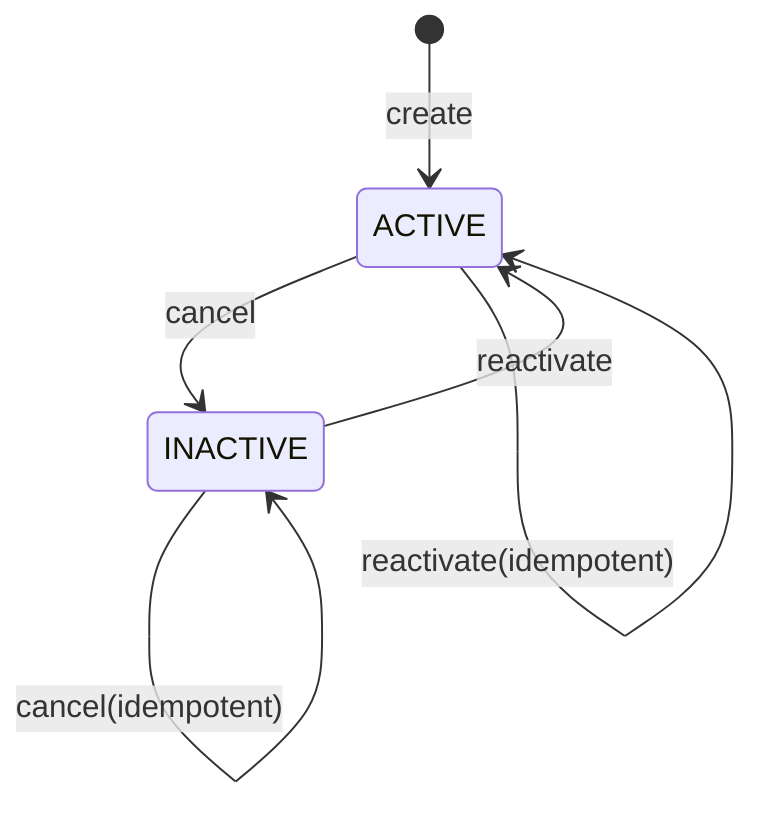
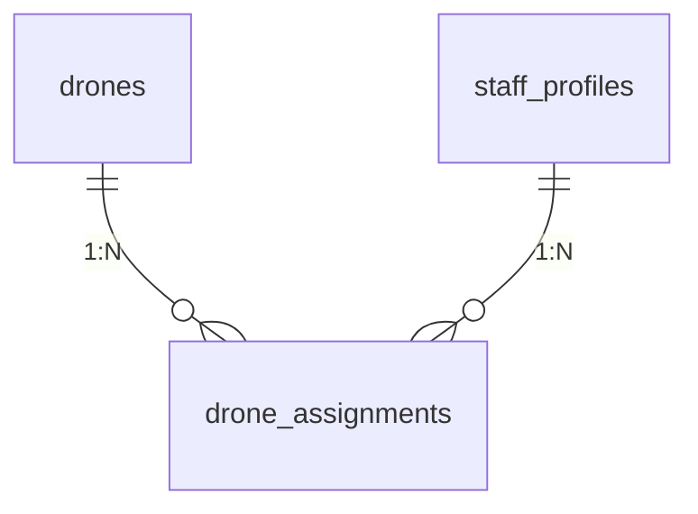

# 低空智能巡检平台 - Drone Assignment 逻辑模型

## 数据库

PostgreSQL

---

## 1. 实体定位

`drone_assignment` 是无人机业务域中的关系实体，描述“无人机与飞手在某时间段内的生效分配”。

核心职责：
1. 支撑无人机分配管理流程。  
2. 作为 `ASSIGNED` 范围鉴权的事实数据来源。  

---

## 2. 实体结构（逻辑层）

实体：`DroneAssignment`

属性：
1. `id`：主键  
2. `drone_id`：关联无人机  
3. `staff_id`：关联飞手  
4. `status`：`ACTIVE | INACTIVE`  
5. `start_at`：生效时间  
6. `end_at`：结束时间  
7. `created_by_staff_id`：操作人  
8. `created_at` / `updated_at`  

---

## 3. 状态机

约束：
1. 支持 `INACTIVE -> ACTIVE` 的恢复动作（reactivate）。  
2. 已失效记录可重复接收取消请求，但状态保持 `INACTIVE`。  
3. 已激活记录重复 reactivate 按幂等成功处理。  

---

## 4. 关系模型

语义说明：
1. 同一无人机可以历史上对应多条分配记录。  
2. 同一飞手可以历史上对应多条分配记录。  
3. 同一 `(drone_id, staff_id)` 同时只能存在一条 `ACTIVE` 关系。  

---

## 5. 业务规则映射

创建分配前置条件：
1. `drone.status != RETIRED`  
2. `staff.employment_status == ACTIVE`  
3. `staff.staff_type.code == pilot_operator`  
4. 不存在同键 `ACTIVE` 记录  

取消分配：
1. `ACTIVE` -> `INACTIVE`，写入 `end_at`。  
2. `INACTIVE` 重复取消，按幂等成功返回。  

恢复分配：
1. `INACTIVE` -> `ACTIVE`，清空 `end_at`。  
2. 请求体必须为空；否则返回 `INVALID_PARAMS`。  
3. 同键已有 `ACTIVE` 记录时返回 `STATE_CONFLICT`。  

---

## 6. 业务响应模型（非持久化字段）

接口响应统一携带：
1. `business_code`
2. `business_detail_code`

典型映射：
1. 创建/取消成功 -> `SUCCESS + OK`  
2. 参数校验失败 -> `INVALID_PARAMS + VALIDATION_ERROR`  
3. 重复分配 -> `IDEMPOTENT_DUPLICATE + DUPLICATE_REQUEST`  
4. 未认证/越权 -> `PERMISSION_DENIED + NOT_AUTHENTICATED/FORBIDDEN`  
5. 记录不存在 -> `RESOURCE_NOT_FOUND + NOT_FOUND`  
