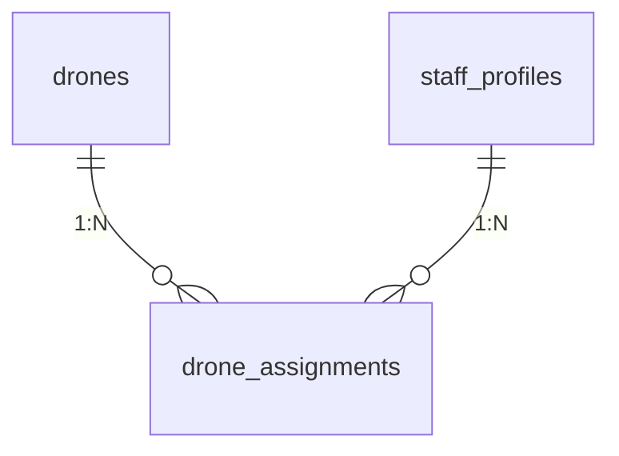

# 低空智能巡检平台 - 无人机

## 数据库

PostgreSQL

---

## 阅读说明

1. 本文档只描述当前代码已落地的业务表结构。  
2. 当前版本仅落地无人机管理域：`drones`、`drone_assignments`。  
3. 任务、航线、飞行记录等属于后续扩展范围，不在本版“当前实现模型”内。

---

## 1. 表结构概览

| 序号 | 表名 | 中文名 | 说明 |
| ---- | ---- | ---- | ---- |
| 1 | drones | 无人机台账表 | 无人机基础信息与状态 |
| 2 | drone_assignments | 无人机分配表 | 无人机与飞手的分配关系 |

---

## 2. 表结构详情

### 2.1 drones（无人机台账表）

| 字段名 | 类型 | 约束 | 说明 |
| ------ | ---- | ---- | ---- |
| id | bigserial | PK | 主键 |
| code | varchar(64) | NOT NULL, UNIQUE | 业务编码 |
| name | varchar(128) | NOT NULL | 无人机名称 |
| model | varchar(128) | NOT NULL | 型号 |
| serial_no | varchar(128) | NOT NULL, UNIQUE | 出厂序列号 |
| status | varchar(16) | NOT NULL, DEFAULT 'DISABLED' | 状态 |
| org_id | bigint | NULL | 组织 ID（预留） |
| created_by_staff_id | bigint | NULL | 创建人 staff ID（审计/OWN 预留） |
| created_at | timestamp | NOT NULL, DEFAULT now() | 创建时间 |
| updated_at | timestamp | NOT NULL, DEFAULT now() | 更新时间 |

`status` 枚举值：
1. `ENABLED`：启用
2. `DISABLED`：停用
3. `MAINTENANCE`：维护中
4. `RETIRED`：已退役

---

### 2.2 drone_assignments（无人机分配表）

| 字段名 | 类型 | 约束 | 说明 |
| ------ | ---- | ---- | ---- |
| id | bigserial | PK | 主键 |
| drone_id | bigint | NOT NULL, FK -> drones.id | 无人机 ID |
| staff_id | bigint | NOT NULL, FK -> staff_profiles.id | 飞手 staff ID |
| status | varchar(16) | NOT NULL, DEFAULT 'ACTIVE' | 分配状态 |
| start_at | timestamp | NOT NULL, DEFAULT now() | 分配生效时间 |
| end_at | timestamp | NULL | 分配结束时间 |
| created_by_staff_id | bigint | NULL | 操作人 staff ID |
| created_at | timestamp | NOT NULL, DEFAULT now() | 创建时间 |
| updated_at | timestamp | NOT NULL, DEFAULT now() | 更新时间 |

`status` 枚举值：
1. `ACTIVE`：生效中
2. `INACTIVE`：已失效

约束：
1. `(drone_id, staff_id)` 在 `status='ACTIVE'` 条件下唯一。  
2. 取消分配采用软失效（更新为 `INACTIVE`），不做物理删除。

---

## 3. 关系图（当前实现）

---

## 4. 与代码对应关系

1. 模型定义：`apps/drone/models.py`  
2. 迁移文件：`apps/drone/migrations/0001_initial.py`  
3. 业务接口：`/api/v1/drones*`、`/api/v1/drone-assignments*`
