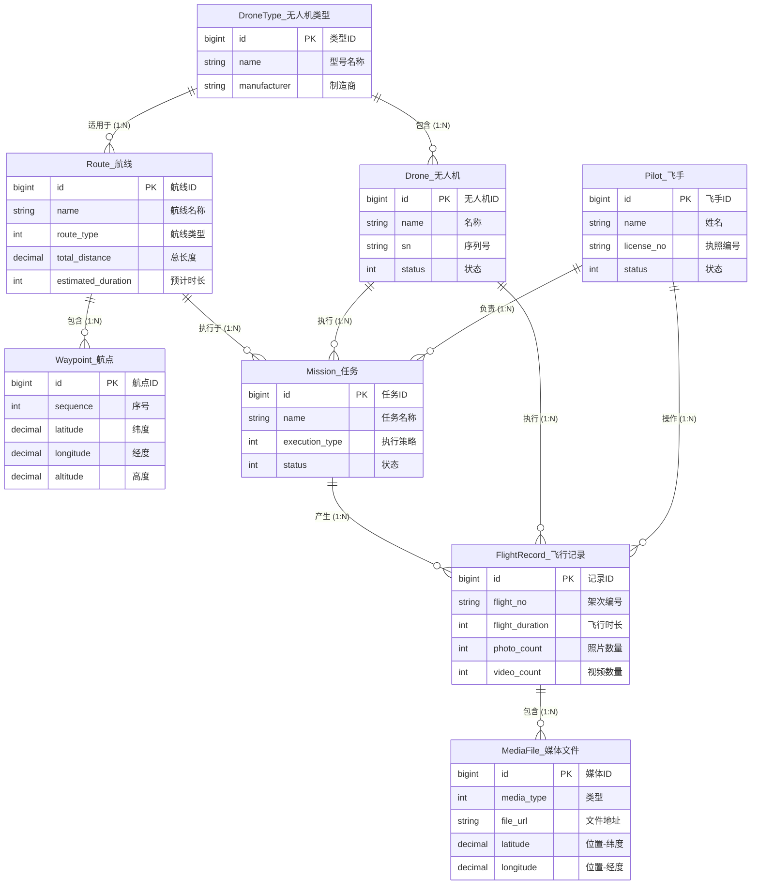

# 低空智能巡检平台 - 概念设计（ER图 / Future）

> 本文档是未来目标域的概念草图，不代表当前代码已落地实现。  
> 当前已实现的业务数据模型请看：`逻辑设计/business_logical_model.md`。

## 涉及模块

- 任务管理
- 航线管理
- 飞行记录
- 飞行控制台

---

## 1. 实体识别

| 实体           | 英文名       | 说明                       | 来源页面             |
| -------------- | ------------ | -------------------------- | -------------------- |
| **无人机类型** | DroneType    | 无人机型号，如大疆Mavic 3E | 航线管理             |
| **无人机**     | Drone        | 具体的无人机设备           | 任务管理、飞行控制台 |
| **飞手**       | Pilot        | 执行飞行任务的操作员       | 任务管理、飞行记录   |
| **航线**       | Route        | 飞行路径规划               | 航线管理             |
| **航点**       | Waypoint     | 航线上的具体坐标点         | 新增航线页面         |
| **任务**       | Mission      | 巡检任务                   | 任务管理             |
| **飞行记录**   | FlightRecord | 一次飞行的执行记录（架次） | 飞行记录             |
| **媒体文件**   | MediaFile    | 拍摄的照片和视频           | 飞行记录             |

---

## 2. ER图（Mermaid）



---

## 3. 实体关系说明

| 关系                     | 基数 | 说明                         |
| ------------------------ | ---- | ---------------------------- |
| DroneType — Drone        | 1:N  | 一种机型有多架无人机         |
| DroneType — Route        | 1:N  | 一种机型适用于多条航线       |
| Route — Waypoint         | 1:N  | 一条航线包含多个航点         |
| Route — Mission          | 1:N  | 一条航线可被多个任务使用     |
| Drone — Mission          | 1:N  | 一架无人机可执行多个任务     |
| Pilot — Mission          | 1:N  | 一个飞手可负责多个任务       |
| Mission — FlightRecord   | 1:N  | 一个任务可产生多条飞行记录   |
| Drone — FlightRecord     | 1:N  | 一架无人机有多条飞行记录     |
| Pilot — FlightRecord     | 1:N  | 一个飞手有多条飞行记录       |
| FlightRecord — MediaFile | 1:N  | 一条飞行记录包含多个媒体文件 |

---

## 4. 核心业务流程

```
航线管理 → 任务管理 → 飞行执行 → 飞行记录
    │           │           │           │
    ▼           ▼           ▼           ▼
  航线        任务      实时控制      媒体文件
  航点      (分配无人机、飞手)
```
