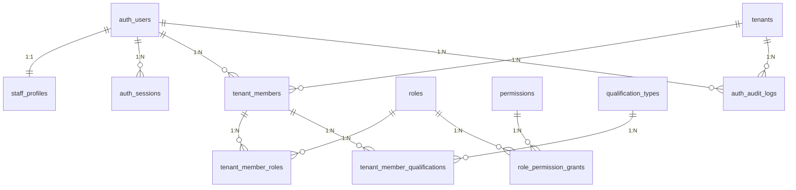

# 低空平台 - 权限系统逻辑数据模型

## 数据库

PostgreSQL

---

## 阅读说明（先看这里）

1. 本文档前半部分讲“当前正式实现的授权主链路”，即正式 Bearer 会话、租户成员、角色、权限、scope 与审计表。
2. Django 自带 `auth_group`、`auth_permission`、`auth_group_permissions`、`auth_users_groups`、`auth_users_user_permissions` 不参与正式 API 的权限计算，放到文末附录说明。
3. 当前正式授权主链固定为：`TenantMember -> TenantMemberRole -> RolePermissionGrant -> Permission`；平台管理员路径为 `User(is_platform_admin=true) -> Role(code=platform_admin) -> RolePermissionGrant -> Permission`。

---

## 1. 核心表结构概览

| 序号 | 表名 | 中文名 | 说明 |
| ---- | ---- | ---- | ---- |
| 1 | auth_users | 账号表 | 登录账号，不承载人员身份事实 |
| 2 | staff_profiles | 人员档案表 | 业务账号全局档案，一账号一 `StaffProfile` |
| 3 | auth_sessions | 认证会话表 | 正式 Bearer 会话（`AuthSession`） |
| 4 | tenants | 租户表 | 租户主数据 |
| 5 | roles | 平台角色目录 | 平台统一角色字典 |
| 6 | permissions | 平台权限目录 | 正式授权使用的权限字典，不是 Django `auth_permission` |
| 7 | role_permission_grants | 角色权限映射表 | 角色到权限及 scope 的默认授权基线 |
| 8 | qualification_types | 资质类型目录 | 平台统一资质类型字典 |
| 9 | tenant_members | 租户成员关系表 | 租户内成员主体 |
| 10 | tenant_member_roles | 成员角色绑定表 | 租户成员与平台角色的绑定 |
| 11 | tenant_member_qualifications | 成员资质记录表 | 租户成员资质记录 |
| 12 | auth_audit_logs | 审计日志表 | 平台级 / 租户级授权与关键操作审计 |

---

## 2. 核心表结构详情

### 2.1 auth_users（账号表）

| 字段名 | 类型 | 约束 | 说明 |
| ------ | ---- | ---- | ---- |
| id | bigserial | PK | 账号 ID |
| username | varchar(150) | NOT NULL, UNIQUE | 登录账号 |
| password | varchar(128) | NOT NULL | 密码哈希 |
| is_staff | boolean | NOT NULL, DEFAULT false | 是否可登录 Django Admin |
| is_active | boolean | NOT NULL, DEFAULT true | Django 账户启用状态 |
| is_superuser | boolean | NOT NULL, DEFAULT false | 技术 Root 标记 |
| is_platform_admin | boolean | NOT NULL, DEFAULT false | 是否平台工作态账号 |
| status | smallint | NOT NULL, DEFAULT 1 | 业务账号状态：1-active, 0-disabled |
| last_login | timestamp |  | 最近登录时间 |
| created_at | timestamp | NOT NULL, DEFAULT now() | 创建时间 |
| updated_at | timestamp | NOT NULL, DEFAULT now() | 更新时间 |

说明：
1. `superuser` 与 `platform_admin` 不能同时为 true。
2. 当账号失活或 `status != ACTIVE` 时，当前代码会撤销该用户仍未撤销的 `AuthSession`。
3. `groups` / `user_permissions` 两条 Django ManyToMany 物理存在，但业务规则禁止作为正式授权来源。

---

### 2.2 staff_profiles（人员档案表）

| 字段名 | 类型 | 约束 | 说明 |
| ------ | ---- | ---- | ---- |
| id | bigserial | PK | 人员档案 ID |
| user_id | bigint | NOT NULL, UNIQUE, FK -> auth_users.id | 关联账号 ID（1:1） |
| name | varchar(64) | NOT NULL | 姓名 |
| phone | varchar(32) |  | 手机号 |
| email | varchar(254) |  | 邮箱 |
| employment_status | smallint | NOT NULL, DEFAULT 1 | 在职状态：1-active, 0-inactive |
| org_id | bigint |  | 组织 ID |
| created_at | timestamp | NOT NULL, DEFAULT now() | 创建时间 |
| updated_at | timestamp | NOT NULL, DEFAULT now() | 更新时间 |

说明：
1. `staff_profiles` 只保留全局人员事实字段。
2. `superuser` 不允许绑定 `StaffProfile`。
3. 租户内显示名、工号、角色不回写到 `staff_profiles`。

---

### 2.3 auth_sessions（认证会话表）

| 字段名 | 类型 | 约束 | 说明 |
| ------ | ---- | ---- | ---- |
| id | bigserial | PK | 会话 ID |
| user_id | bigint | NOT NULL, FK -> auth_users.id | 关联账号 |
| session_type | varchar(16) | NOT NULL | 会话类型：`BUSINESS` / `PLATFORM` |
| access_token_hash | varchar(64) | NOT NULL, UNIQUE | access token 哈希 |
| refresh_token_hash | varchar(64) | NOT NULL, UNIQUE | refresh token 哈希 |
| access_token_expires_at | timestamp | NOT NULL | access token 过期时间 |
| refresh_token_expires_at | timestamp | NOT NULL | refresh token 过期时间 |
| revoked_at | timestamp |  | 撤销时间 |
| last_refreshed_at | timestamp |  | 最近刷新时间 |
| last_used_at | timestamp |  | 最近使用时间 |
| created_ip | inet / varchar |  | 创建 IP |
| last_used_ip | inet / varchar |  | 最近使用 IP |
| user_agent | varchar(255) | NOT NULL, DEFAULT '' | 客户端 UA |
| created_at | timestamp | NOT NULL, DEFAULT now() | 创建时间 |
| updated_at | timestamp | NOT NULL, DEFAULT now() | 更新时间 |

说明：
1. 正式 `/api/v1/*` Bearer Token 会话由该表承载。
2. 当前实现为 `user + revoked_at`、`access_token_expires_at`、`refresh_token_expires_at` 建立索引。

---

### 2.4 tenants（租户表）

| 字段名 | 类型 | 约束 | 说明 |
| ------ | ---- | ---- | ---- |
| id | bigserial | PK | 租户 ID |
| code | varchar(64) | NOT NULL, UNIQUE | 租户编码 |
| name | varchar(128) | NOT NULL | 租户名称 |
| status | smallint | NOT NULL, DEFAULT 1 | 状态：1-active, 0-disabled |
| plan | varchar(64) | NOT NULL, DEFAULT '' | 套餐 |
| remark | varchar(500) | NOT NULL, DEFAULT '' | 备注 |
| created_at | timestamp | NOT NULL, DEFAULT now() | 创建时间 |
| updated_at | timestamp | NOT NULL, DEFAULT now() | 更新时间 |

---

### 2.5 roles（平台角色目录）

| 字段名 | 类型 | 约束 | 说明 |
| ------ | ---- | ---- | ---- |
| id | bigserial | PK | 角色 ID |
| code | varchar(64) | NOT NULL, UNIQUE | 角色机器码 |
| name | varchar(128) | NOT NULL | 角色名称 |
| description | varchar(500) | NOT NULL, DEFAULT '' | 角色描述 |
| status | smallint | NOT NULL, DEFAULT 1 | 状态：1-active, 0-disabled |
| created_at | timestamp | NOT NULL, DEFAULT now() | 创建时间 |
| updated_at | timestamp | NOT NULL, DEFAULT now() | 更新时间 |

当前种子角色：`platform_admin`、`tenant_admin`、`business_admin`、`route_planner`、`dispatcher`、`pilot_operator`、`auditor`。

---

### 2.6 permissions（平台权限目录）

| 字段名 | 类型 | 约束 | 说明 |
| ------ | ---- | ---- | ---- |
| id | bigserial | PK | 权限 ID |
| code | varchar(128) | NOT NULL, UNIQUE | 权限编码，如 `drone.view_drone` |
| name | varchar(128) | NOT NULL | 权限名称 |
| module | varchar(64) | NOT NULL | 模块名 |
| resource_code | varchar(64) | NOT NULL, DEFAULT '' | 资源编码 |
| description | varchar(500) | NOT NULL, DEFAULT '' | 描述 |
| status | smallint | NOT NULL, DEFAULT 1 | 状态：1-active, 0-disabled |
| created_at | timestamp | NOT NULL, DEFAULT now() | 创建时间 |
| updated_at | timestamp | NOT NULL, DEFAULT now() | 更新时间 |

说明：
1. 正式授权读取的是 `permissions` 表，不是 Django 的 `auth_permission`。
2. 当前实现为 `(module, status)` 建立索引。
3. 若 scope 使用 `OWN / ASSIGNED`，则要求 `resource_code` 非空。

---

### 2.7 role_permission_grants（角色权限映射表）

| 字段名 | 类型 | 约束 | 说明 |
| ------ | ---- | ---- | ---- |
| id | bigserial | PK | 映射 ID |
| role_id | bigint | NOT NULL, FK -> roles.id | 角色 ID |
| permission_id | bigint | NOT NULL, FK -> permissions.id | 权限 ID |
| scope_type | varchar(16) | NOT NULL, DEFAULT 'ALL' | 范围：`ALL / OWN / ASSIGNED` |
| created_at | timestamp | NOT NULL, DEFAULT now() | 创建时间 |
| updated_at | timestamp | NOT NULL, DEFAULT now() | 更新时间 |

唯一约束：`(role_id, permission_id)`

说明：`seed_role_permissions.py` 是当前角色权限基线的来源。

---

### 2.8 qualification_types（资质类型目录）

| 字段名 | 类型 | 约束 | 说明 |
| ------ | ---- | ---- | ---- |
| id | bigserial | PK | 资质类型 ID |
| code | varchar(64) | NOT NULL, UNIQUE | 资质编码 |
| name | varchar(128) | NOT NULL | 资质名称 |
| description | varchar(500) | NOT NULL, DEFAULT '' | 资质描述 |
| requires_validity | boolean | NOT NULL, DEFAULT false | 是否要求有效期 |
| payload_schema_json | json |  | 扩展字段 schema |
| status | smallint | NOT NULL, DEFAULT 1 | 状态：1-active, 0-disabled |
| created_at | timestamp | NOT NULL, DEFAULT now() | 创建时间 |
| updated_at | timestamp | NOT NULL, DEFAULT now() | 更新时间 |

---

### 2.9 tenant_members（租户成员关系表）

| 字段名 | 类型 | 约束 | 说明 |
| ------ | ---- | ---- | ---- |
| id | bigserial | PK | 成员关系 ID |
| tenant_id | bigint | NOT NULL, FK -> tenants.id | 所属租户 |
| user_id | bigint | NOT NULL, FK -> auth_users.id | 账号 ID |
| member_no | varchar(64) |  | 租户内工号 |
| display_name | varchar(128) | NOT NULL, DEFAULT '' | 显示名称 |
| invitation_token | varchar(64) |  | 邀请令牌 |
| invited_by_user_id | bigint | FK -> auth_users.id | 邀请人 |
| invited_at | timestamp |  | 邀请时间 |
| expires_at | timestamp |  | 邀请过期时间 |
| responded_at | timestamp |  | 响应时间 |
| joined_at | timestamp |  | 加入时间 |
| status | smallint | NOT NULL, DEFAULT 0 | 状态：`INVITED / ACTIVE / REJECTED / EXPIRED / REVOKED / DISABLED` |
| created_at | timestamp | NOT NULL, DEFAULT now() | 创建时间 |
| updated_at | timestamp | NOT NULL, DEFAULT now() | 更新时间 |

约束：
1. 唯一约束：`(tenant_id, user_id)`。
2. `member_no` 在同租户内仅在“非空时”唯一。
3. `invitation_token` 仅在“非空时”唯一。

说明：
1. `superuser` 与 `platform_admin` 不允许成为 `TenantMember`。
2. `TenantMember` 绑定账号前必须先存在 `StaffProfile`。
3. 邀请态 / 激活态 / 禁用态 / 拒绝态 / 过期态字段组合由模型 `clean()` 严格校验。

---

### 2.10 tenant_member_roles（成员角色绑定表）

| 字段名 | 类型 | 约束 | 说明 |
| ------ | ---- | ---- | ---- |
| id | bigserial | PK | 绑定 ID |
| tenant_member_id | bigint | NOT NULL, FK -> tenant_members.id | 成员关系 ID |
| system_role_id | bigint | NOT NULL, FK -> roles.id | 角色 ID |
| status | smallint | NOT NULL, DEFAULT 1 | 状态：`GRANTED / REVOKED` |
| assigned_by_user_id | bigint | FK -> auth_users.id | 分配人 |
| assigned_at | timestamp |  | 分配时间 |
| created_at | timestamp | NOT NULL, DEFAULT now() | 创建时间 |
| updated_at | timestamp | NOT NULL, DEFAULT now() | 更新时间 |

唯一约束：`(tenant_member_id, system_role_id)`

说明：
1. 当前代码中外键字段名为 `system_role_id`，指向 `roles.id`。
2. `platform_admin` 角色不允许分配给租户成员。
3. 当状态为 `GRANTED` 时，`assigned_at` 必填。

---

### 2.11 tenant_member_qualifications（成员资质记录表）

| 字段名 | 类型 | 约束 | 说明 |
| ------ | ---- | ---- | ---- |
| id | bigserial | PK | 资质记录 ID |
| tenant_member_id | bigint | NOT NULL, FK -> tenant_members.id | 成员关系 ID |
| qualification_type_id | bigint | NOT NULL, FK -> qualification_types.id | 资质类型 ID |
| certificate_no | varchar(128) | NOT NULL, DEFAULT '' | 证书编号 |
| level | varchar(64) | NOT NULL, DEFAULT '' | 等级 |
| status | smallint | NOT NULL, DEFAULT 1 | 状态：`ACTIVE / INVALID / REVOKED` |
| issued_at | date |  | 发证日期 |
| valid_from | date |  | 有效开始日期 |
| valid_until | date |  | 有效截止日期 |
| issuer | varchar(128) | NOT NULL, DEFAULT '' | 发证机构 |
| payload_json | json | NOT NULL, DEFAULT {} | 扩展信息 |
| created_at | timestamp | NOT NULL, DEFAULT now() | 创建时间 |
| updated_at | timestamp | NOT NULL, DEFAULT now() | 更新时间 |

说明：
1. 当前实现对 `(tenant_member_id, qualification_type_id)`、`(tenant_member_id, status)` 建立索引。
2. 若资质类型要求有效期，则 `valid_from` 与 `valid_until` 必填。
3. 若两端都存在，则要求 `valid_from <= valid_until`。
4. `payload_json` 会按 `qualification_types.payload_schema_json.required` 校验必填扩展字段。

---

### 2.12 auth_audit_logs（审计日志表）

| 字段名 | 类型 | 约束 | 说明 |
| ------ | ---- | ---- | ---- |
| id | bigserial | PK | 日志 ID |
| tenant_id | bigint | FK -> tenants.id | 所属租户；平台级日志可为空 |
| actor_user_id | bigint | FK -> auth_users.id | 操作人账号 |
| action | varchar(128) | NOT NULL | 动作码 |
| target_type | varchar(128) | NOT NULL | 目标类型 |
| target_id | varchar(64) | NOT NULL, DEFAULT '' | 目标主键 |
| before_data | json |  | 变更前快照 |
| after_data | json |  | 变更后快照 |
| ip | varchar(39) |  | 请求 IP |
| request_id | varchar(64) | NOT NULL, DEFAULT '' | 请求追踪 ID |
| created_at | timestamp | NOT NULL, DEFAULT now() | 创建时间 |

说明：该表统一记录平台级 / 租户级授权与关键资源变更行为。

---

## 3. 关系图（仅核心链路）

---

## 4. 关键授权规则（与代码一致）

1. 正式 API 的授权主链只认：`TenantMember -> TenantMemberRole -> RolePermissionGrant -> Permission`。
2. 平台工作态不是走 `TenantMember` 链，而是由 `User.is_platform_admin=true` 命中 `platform_admin` 角色基线。
3. `permissions` 表才是正式权限目录；Django `auth_permission` 不参与正式 API 的权限判断。
4. scope 冲突合并规则固定：`ALL > ASSIGNED > OWN`。
5. 有权限但没有合法 scope 配置时，默认拒绝。
6. `OWN / ASSIGNED` 权限映射要求 `Permission.resource_code` 非空。
7. `superuser` 不属于正式 IAM Bearer 会话集合，不能通过 `/api/v1/iam/session/login` 建立正式会话；但通用授权服务仍把“已认证且激活的 superuser”视为技术 root。
8. `platform_admin` 不允许成为 `TenantMember`，也不允许被分配到 `tenant_member_roles`。
9. `TenantMember.status=ACTIVE` 只是成员关系激活；是否有实际权限还取决于是否存在 `TenantMemberRole(status=GRANTED)`。
10. 当前租户不允许失去最后一个有效 `tenant_admin`。
11. 邀请链路、成员状态流转、资质有效期等关键约束均下沉到模型 `clean() + save()->full_clean()`。

---

## 5. 附录：Django 辅助表（仅框架兼容 / 运行支撑）

### 5.1 辅助表概览

| 序号 | 表名 | 中文名 | 说明 |
| ---- | ---- | ---- | ---- |
| 1 | auth_group | Django 组表 | 框架内建 Group，当前正式授权链不使用 |
| 2 | auth_permission | Django 权限字典表 | 模型 `Meta.permissions` 生成的 Django 权限字典 |
| 3 | auth_group_permissions | 组权限关系表 | Group 到 Django Permission 的 M:N |
| 4 | auth_users_groups | 用户直绑组关系表 | 自定义 `User.groups` 的物理中间表，业务禁用 |
| 5 | auth_users_user_permissions | 用户直绑权限关系表 | 自定义 `User.user_permissions` 的物理中间表，业务禁用 |
| 6 | django_content_type | 内容类型表 | Django 模型类型字典 |
| 7 | django_migrations | 迁移记录表 | 迁移执行历史 |
| 8 | django_session | Session 表 | Django Admin / Session 登录态 |
| 9 | django_admin_log | Admin 操作日志表 | Django Admin 对象变更日志 |

### 5.2 辅助表说明

#### 5.2.1 auth_group（Django 组表）

| 字段名 | 类型 | 约束 | 说明 |
| ------ | ---- | ---- | ---- |
| id | integer | PK | 组 ID |
| name | varchar(150) | NOT NULL, UNIQUE | 组名称 |

说明：当前代码保留该表是为了兼容 Django `PermissionsMixin`，正式授权不读取它。

#### 5.2.2 auth_permission（Django 权限字典表）

| 字段名 | 类型 | 约束 | 说明 |
| ------ | ---- | ---- | ---- |
| id | integer | PK | 权限 ID |
| name | varchar(255) | NOT NULL | 权限中文名 |
| content_type_id | integer | NOT NULL | 模型类型 ID |
| codename | varchar(100) | NOT NULL | 权限码后半段 |

唯一约束：`(content_type_id, codename)`

说明：该表由 Django 根据模型 `Meta.permissions` / `default_permissions` 维护；Admin 权限会用到它，但正式 API 授权不读取它。

#### 5.2.3 auth_group_permissions（组权限关系表）

| 字段名 | 类型 | 约束 | 说明 |
| ------ | ---- | ---- | ---- |
| id | integer | PK | 关系 ID |
| group_id | integer | NOT NULL, FK -> auth_group.id | 组 ID |
| permission_id | integer | NOT NULL, FK -> auth_permission.id | 权限 ID |

唯一约束：`(group_id, permission_id)`

#### 5.2.4 auth_users_groups（用户直绑组关系表）

| 字段名 | 类型 | 约束 | 说明 |
| ------ | ---- | ---- | ---- |
| id | integer | PK | 关系 ID |
| user_id | bigint | NOT NULL, FK -> auth_users.id | 账号 ID |
| group_id | integer | NOT NULL, FK -> auth_group.id | 组 ID |

唯一约束：`(user_id, group_id)`

说明：物理存在，但当前业务规则禁止把它作为授权入口。

#### 5.2.5 auth_users_user_permissions（用户直绑权限关系表）

| 字段名 | 类型 | 约束 | 说明 |
| ------ | ---- | ---- | ---- |
| id | integer | PK | 关系 ID |
| user_id | bigint | NOT NULL, FK -> auth_users.id | 账号 ID |
| permission_id | integer | NOT NULL, FK -> auth_permission.id | 权限 ID |

唯一约束：`(user_id, permission_id)`

说明：物理存在，但当前业务规则禁止把它作为授权入口。

#### 5.2.6 django_content_type（内容类型表）

| 字段名 | 类型 | 约束 | 说明 |
| ------ | ---- | ---- | ---- |
| id | integer | PK | 内容类型 ID |
| app_label | varchar(100) | NOT NULL | 应用名 |
| model | varchar(100) | NOT NULL | 模型名 |

唯一约束：`(app_label, model)`

#### 5.2.7 django_migrations（迁移记录表）

作用：记录迁移执行历史，用于判定数据库结构处于哪个迁移版本。

#### 5.2.8 django_session（Session 表）

作用：存储 Django Session，会用于浏览器登录 Admin 等场景；不承载正式 IAM Bearer Token。

#### 5.2.9 django_admin_log（Admin 操作日志表）

作用：记录 Django Admin 的对象变更日志，与 `auth_audit_logs` 的业务审计互补。
