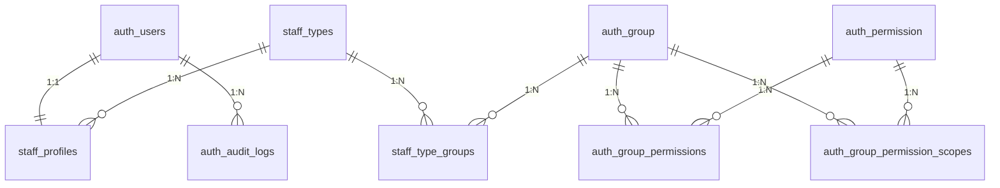

# 低空平台 - 权限系统逻辑数据模型

## 数据库

PostgreSQL

---

## 阅读说明（先看这里）

1. 本文档前半部分讲“完整授权模型”，包含参与授权设计的 Django 内建表（如 `auth_group`、`auth_permission`）。
2. 关系图展示授权主链路，保证不看附录也能理解权限计算。
3. 文末附录只保留纯框架运行辅助表，主要给改底层代码的人参考。

---

## 1. 核心表结构概览

| 序号 | 表名 | 中文名 | 说明 |
| ---- | ---- | ---- | ---- |
| 1 | auth_users | 账号表 | 登录账号，不承载人员身份事实 |
| 2 | staff_types | 身份类型表 | 岗位类型字典（如 Admin 管理员、飞手） |
| 3 | staff_profiles | 人员档案表 | 一账号一 Staff，承载 name/phone/email |
| 4 | auth_group | 能力组表 | Django Group，权限能力模块 |
| 5 | auth_permission | 权限字典表 | 权限码（`app_label.codename`） |
| 6 | auth_group_permissions | 组权限关系表 | Group 到 Permission 的 M:N |
| 7 | auth_group_permission_scopes | 组权限范围表 | Group + Permission 的范围策略 |
| 8 | staff_type_groups | 身份类型能力组映射表 | StaffType 到 Group 的 M:N |
| 9 | auth_audit_logs | 审计日志表 | 关键授权动作审计追踪 |

---

## 2. 核心表结构详情

### 2.1 auth_users（账号表）

| 字段名 | 类型 | 约束 | 说明 |
| ------ | ---- | ---- | ---- |
| id | bigserial | PK | 账号 ID |
| username | varchar(150) | NOT NULL, UNIQUE | 登录账号 |
| password | varchar(128) | NOT NULL | 密码哈希 |
| is_staff | boolean | NOT NULL, DEFAULT false | 是否可登录 Django Admin |
| is_active | boolean | NOT NULL, DEFAULT true | Django 账户状态 |
| is_superuser | boolean | NOT NULL, DEFAULT false | 超级管理员（Root，系统+业务全量） |
| status | smallint | NOT NULL, DEFAULT 1 | 业务账号状态：1-active, 0-disabled |
| last_login | timestamp |  | 最近登录时间 |
| created_at | timestamp | NOT NULL, DEFAULT now() | 创建时间 |
| updated_at | timestamp | NOT NULL, DEFAULT now() | 更新时间 |

---

### 2.2 staff_types（身份类型表）

| 字段名 | 类型 | 约束 | 说明 |
| ------ | ---- | ---- | ---- |
| id | bigserial | PK | 身份类型 ID |
| code | varchar(64) | NOT NULL, UNIQUE | 机器码，如 `ops_admin` |
| name | varchar(64) | NOT NULL | 中文名 |
| description | varchar(255) |  | 描述 |
| status | smallint | NOT NULL, DEFAULT 1 | 状态：1-active, 0-disabled |
| created_at | timestamp | NOT NULL, DEFAULT now() | 创建时间 |
| updated_at | timestamp | NOT NULL, DEFAULT now() | 更新时间 |

---

### 2.3 staff_profiles（人员档案表）

| 字段名 | 类型 | 约束 | 说明 |
| ------ | ---- | ---- | ---- |
| id | bigserial | PK | 人员档案 ID |
| user_id | bigint | NOT NULL, UNIQUE, FK -> auth_users.id | 关联账号 ID（1:1） |
| name | varchar(64) | NOT NULL | 姓名 |
| phone | varchar(32) |  | 手机号 |
| email | varchar(254) |  | 邮箱 |
| employment_status | smallint | NOT NULL, DEFAULT 1 | 在职状态：1-active, 0-inactive |
| org_id | bigint |  | 组织 ID |
| created_at | timestamp | NOT NULL, DEFAULT now() | 创建时间 |
| updated_at | timestamp | NOT NULL, DEFAULT now() | 更新时间 |

说明：`staff_profiles` 只保留全局人员档案字段；业务工号统一迁移到 `tenant_members.member_no`。

---

### 2.4 auth_group（能力组表）

| 字段名 | 类型 | 约束 | 说明 |
| ------ | ---- | ---- | ---- |
| id | integer | PK | 组 ID |
| name | varchar(150) | NOT NULL, UNIQUE | 组名称 |

---

### 2.5 auth_permission（权限点字典表）

| 字段名 | 类型 | 约束 | 说明 |
| ------ | ---- | ---- | ---- |
| id | integer | PK | 权限 ID |
| name | varchar(255) | NOT NULL | 权限中文名 |
| content_type_id | integer | NOT NULL | 内容类型 ID（由 `django_content_type` 管理，见附录） |
| codename | varchar(100) | NOT NULL | 权限码后半段 |

唯一约束：`(content_type_id, codename)`

---

### 2.6 auth_group_permissions（组权限关系表）

| 字段名 | 类型 | 约束 | 说明 |
| ------ | ---- | ---- | ---- |
| id | integer | PK | 关系 ID |
| group_id | integer | NOT NULL, FK -> auth_group.id | 组 ID |
| permission_id | integer | NOT NULL, FK -> auth_permission.id | 权限 ID |

唯一约束：`(group_id, permission_id)`

---

### 2.7 auth_group_permission_scopes（组权限范围表）

| 字段名 | 类型 | 约束 | 说明 |
| ------ | ---- | ---- | ---- |
| id | bigserial | PK | 范围策略 ID |
| group_id | integer | NOT NULL, FK -> auth_group.id | 组 ID |
| permission_id | integer | NOT NULL, FK -> auth_permission.id | 权限 ID |
| scope_type | varchar(16) | NOT NULL | 范围：`ALL/ASSIGNED/OWN` |
| status | smallint | NOT NULL, DEFAULT 1 | 状态：1-active, 0-disabled |
| created_at | timestamp | NOT NULL, DEFAULT now() | 创建时间 |
| updated_at | timestamp | NOT NULL, DEFAULT now() | 更新时间 |

唯一约束：`(group_id, permission_id)`

---

### 2.8 staff_type_groups（身份类型能力组映射表）

| 字段名 | 类型 | 约束 | 说明 |
| ------ | ---- | ---- | ---- |
| id | bigserial | PK | 映射 ID |
| staff_type_id | bigint | NOT NULL, FK -> staff_types.id | 身份类型 ID |
| group_id | integer | NOT NULL, FK -> auth_group.id | 能力组 ID |
| status | smallint | NOT NULL, DEFAULT 1 | 状态：1-active, 0-disabled |
| created_at | timestamp | NOT NULL, DEFAULT now() | 创建时间 |
| updated_at | timestamp | NOT NULL, DEFAULT now() | 更新时间 |

唯一约束：`(staff_type_id, group_id)`

---

### 2.9 auth_audit_logs（审计日志表）

| 字段名 | 类型 | 约束 | 说明 |
| ------ | ---- | ---- | ---- |
| id | bigserial | PK | 日志 ID |
| actor_user_id | bigint | FK -> auth_users.id | 操作人账号 ID |
| action | varchar(128) | NOT NULL | 动作码 |
| target_type | varchar(128) | NOT NULL | 目标类型 |
| target_id | varchar(64) |  | 目标主键 |
| before_data | json |  | 变更前快照 |
| after_data | json |  | 变更后快照 |
| ip | varchar(39) |  | 请求 IP |
| request_id | varchar(64) |  | 请求追踪 ID |
| created_at | timestamp | NOT NULL, DEFAULT now() | 创建时间 |

---

## 3. 关系图（仅核心链路）

---

## 4. 关键授权规则（与代码一致）

1. 授权链路只认：`staff_type -> group -> permission + scope`。
2. scope 冲突合并：`ALL > ASSIGNED > OWN`。
3. 禁止用户直绑 `Group` 和 `Permission`（虽有物理表，业务层禁用）。
4. 非 superuser 必须绑定 1 条 `staff_profile`；superuser 作为 Root 账号直接拥有系统与业务全量权限。

---

## 5. 附录：Django 辅助表（仅改代码时关注）

### 5.1 辅助表概览

| 序号 | 表名 | 中文名 | 说明 |
| ---- | ---- | ---- | ---- |
| 1 | django_content_type | 内容类型表 | Django 内置模型类型字典 |
| 2 | auth_users_groups | 用户直绑组关系表 | 物理存在，业务规则禁止使用 |
| 3 | auth_users_user_permissions | 用户直绑权限关系表 | 物理存在，业务规则禁止使用 |

### 5.2 辅助表说明

#### 5.2.1 django_content_type（内容类型表）

| 字段名 | 类型 | 约束 | 说明 |
| ------ | ---- | ---- | ---- |
| id | integer | PK | 内容类型 ID |
| app_label | varchar(100) | NOT NULL | 应用名 |
| model | varchar(100) | NOT NULL | 模型名 |

唯一约束：`(app_label, model)`

#### 5.2.2 auth_users_groups（用户直绑组关系表）

| 字段名 | 类型 | 约束 | 说明 |
| ------ | ---- | ---- | ---- |
| id | integer | PK | 关系 ID |
| user_id | bigint | NOT NULL, FK -> auth_users.id | 账号 ID |
| group_id | integer | NOT NULL, FK -> auth_group.id | 组 ID |

唯一约束：`(user_id, group_id)`

说明：该表由 Django 提供，当前业务规则已禁止使用这条授权路径。

#### 5.2.3 auth_users_user_permissions（用户直绑权限关系表）

| 字段名 | 类型 | 约束 | 说明 |
| ------ | ---- | ---- | ---- |
| id | integer | PK | 关系 ID |
| user_id | bigint | NOT NULL, FK -> auth_users.id | 账号 ID |
| permission_id | integer | NOT NULL, FK -> auth_permission.id | 权限 ID |

唯一约束：`(user_id, permission_id)`

说明：该表由 Django 提供，当前业务规则已禁止使用这条授权路径。
