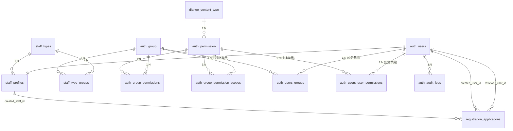

# 低空平台 - 权限系统逻辑数据模型

## 数据库

PostgreSQL

---

## 1. 表结构概览

| 序号 | 表名                        | 中文名                 | 说明 |
| ---- | --------------------------- | ---------------------- | ---- |
| 1    | auth_users                  | 账号表                 | 登录账号，不承载人员身份事实 |
| 2    | staff_types                 | 身份类型表             | 岗位类型字典（如Admin管理员、飞手） |
| 3    | staff_profiles              | 人员档案表             | 一账号一Staff，承载 name/phone/email |
| 4    | registration_applications   | 注册申请表             | 业务侧提交申请，IAM 审核开户 |
| 5    | auth_group                  | 能力组表               | Django Group，权限能力模块 |
| 6    | django_content_type         | 内容类型表             | Django 内置模型类型字典 |
| 7    | auth_permission             | 权限点字典表           | 权限码源（app_label + codename） |
| 8    | auth_group_permissions      | 组权限关系表           | Group 到 Permission 的 M:N |
| 9    | auth_group_permission_scopes| 组权限范围表           | Group+Permission 的范围策略 |
| 10   | staff_type_groups           | 身份类型能力组映射表   | StaffType 到 Group 的 M:N |
| 11   | auth_users_groups           | 用户直绑组关系表       | 物理存在，业务规则禁止使用 |
| 12   | auth_users_user_permissions | 用户直绑权限关系表     | 物理存在，业务规则禁止使用 |
| 13   | auth_audit_logs             | 审计日志表             | 关键授权动作审计追踪 |

---

## 2. 表结构详情

### 2.1 auth_users（账号表）

| 字段名 | 类型 | 约束 | 说明 |
| ------ | ---- | ---- | ---- |
| id | bigserial | PK | 账号ID |
| username | varchar(150) | NOT NULL, UNIQUE | 登录账号 |
| password | varchar(128) | NOT NULL | 密码哈希 |
| is_staff | boolean | NOT NULL, DEFAULT false | 是否可登录 Django Admin |
| is_active | boolean | NOT NULL, DEFAULT true | Django 账户状态 |
| is_superuser | boolean | NOT NULL, DEFAULT false | 超级管理员（Root，系统+业务全量） |
| status | smallint | NOT NULL, DEFAULT 1 | 业务账号状态：1-active, 0-disabled |
| last_login | timestamp |  | 最近登录时间 |
| created_at | timestamp | NOT NULL, DEFAULT now() | 创建时间 |
| updated_at | timestamp | NOT NULL, DEFAULT now() | 更新时间 |

---

### 2.2 staff_types（身份类型表）

| 字段名 | 类型 | 约束 | 说明 |
| ------ | ---- | ---- | ---- |
| id | bigserial | PK | 身份类型ID |
| code | varchar(64) | NOT NULL, UNIQUE | 机器码，如 `ops_admin` |
| name | varchar(64) | NOT NULL | 中文名 |
| description | varchar(255) |  | 描述 |
| is_registrable | boolean | NOT NULL, DEFAULT false | 是否可用于注册申请 |
| status | smallint | NOT NULL, DEFAULT 1 | 状态：1-active, 0-disabled |
| created_at | timestamp | NOT NULL, DEFAULT now() | 创建时间 |
| updated_at | timestamp | NOT NULL, DEFAULT now() | 更新时间 |

---

### 2.3 staff_profiles（人员档案表）

| 字段名 | 类型 | 约束 | 说明 |
| ------ | ---- | ---- | ---- |
| id | bigserial | PK | 人员档案ID |
| user_id | bigint | NOT NULL, UNIQUE, FK -> auth_users.id | 关联账号ID（1:1） |
| staff_no | varchar(64) | NOT NULL, UNIQUE | 工号 |
| name | varchar(64) | NOT NULL | 姓名 |
| phone | varchar(32) |  | 手机号 |
| email | varchar(254) |  | 邮箱 |
| employment_status | smallint | NOT NULL, DEFAULT 1 | 在职状态：1-active, 0-inactive |
| staff_type_id | bigint | NOT NULL, FK -> staff_types.id | 身份类型ID |
| org_id | bigint |  | 组织ID |
| created_at | timestamp | NOT NULL, DEFAULT now() | 创建时间 |
| updated_at | timestamp | NOT NULL, DEFAULT now() | 更新时间 |

---

### 2.4 registration_applications（注册申请表）

| 字段名 | 类型 | 约束 | 说明 |
| ------ | ---- | ---- | ---- |
| id | bigserial | PK | 申请ID |
| application_no | varchar(32) | NOT NULL, UNIQUE | 申请单号 |
| name | varchar(64) | NOT NULL | 申请人姓名 |
| phone | varchar(32) | NOT NULL | 申请手机号 |
| email | varchar(254) | NOT NULL | 申请邮箱 |
| requested_staff_type_code | varchar(64) | NOT NULL | 申请岗位类型 |
| requested_org_id | bigint |  | 申请组织ID |
| application_note | varchar(255) |  | 申请备注 |
| status | varchar(32) | NOT NULL, DEFAULT `PENDING_REVIEW` | 状态机：`PENDING_REVIEW/APPROVED_ACCOUNT_CREATED/REJECTED` |
| reviewer_user_id | bigint | FK -> auth_users.id | 审核人 |
| reviewed_at | timestamp |  | 审核时间 |
| review_comment | varchar(255) |  | 审核备注/驳回原因 |
| created_user_id | bigint | FK -> auth_users.id | 审核通过后创建账号ID |
| created_staff_id | bigint | FK -> staff_profiles.id | 审核通过后创建档案ID |
| created_at | timestamp | NOT NULL, DEFAULT now() | 创建时间 |
| updated_at | timestamp | NOT NULL, DEFAULT now() | 更新时间 |

部分唯一约束（PostgreSQL）：
- `uniq_pending_registration_phone`：`phone` 在 `status=PENDING_REVIEW` 下唯一
- `uniq_pending_registration_email`：`email` 在 `status=PENDING_REVIEW` 下唯一

---

### 2.5 auth_group（能力组表）

| 字段名 | 类型 | 约束 | 说明 |
| ------ | ---- | ---- | ---- |
| id | integer | PK | 组ID |
| name | varchar(150) | NOT NULL, UNIQUE | 组名称 |

---

### 2.6 django_content_type（内容类型表）

| 字段名 | 类型 | 约束 | 说明 |
| ------ | ---- | ---- | ---- |
| id | integer | PK | 内容类型ID |
| app_label | varchar(100) | NOT NULL | 应用名 |
| model | varchar(100) | NOT NULL | 模型名 |

唯一约束：`(app_label, model)`

---

### 2.7 auth_permission（权限点字典表）

| 字段名 | 类型 | 约束 | 说明 |
| ------ | ---- | ---- | ---- |
| id | integer | PK | 权限ID |
| name | varchar(255) | NOT NULL | 权限中文名 |
| content_type_id | integer | NOT NULL, FK -> django_content_type.id | 内容类型ID |
| codename | varchar(100) | NOT NULL | 权限码后半段 |

唯一约束：`(content_type_id, codename)`

---

### 2.8 auth_group_permissions（组权限关系表）

| 字段名 | 类型 | 约束 | 说明 |
| ------ | ---- | ---- | ---- |
| id | integer | PK | 关系ID |
| group_id | integer | NOT NULL, FK -> auth_group.id | 组ID |
| permission_id | integer | NOT NULL, FK -> auth_permission.id | 权限ID |

唯一约束：`(group_id, permission_id)`

---

### 2.9 auth_group_permission_scopes（组权限范围表）

| 字段名 | 类型 | 约束 | 说明 |
| ------ | ---- | ---- | ---- |
| id | bigserial | PK | 范围策略ID |
| group_id | integer | NOT NULL, FK -> auth_group.id | 组ID |
| permission_id | integer | NOT NULL, FK -> auth_permission.id | 权限ID |
| scope_type | varchar(16) | NOT NULL | 范围：`ALL/ASSIGNED/OWN` |
| status | smallint | NOT NULL, DEFAULT 1 | 状态：1-active, 0-disabled |
| created_at | timestamp | NOT NULL, DEFAULT now() | 创建时间 |
| updated_at | timestamp | NOT NULL, DEFAULT now() | 更新时间 |

唯一约束：`(group_id, permission_id)`

---

### 2.10 staff_type_groups（身份类型能力组映射表）

| 字段名 | 类型 | 约束 | 说明 |
| ------ | ---- | ---- | ---- |
| id | bigserial | PK | 映射ID |
| staff_type_id | bigint | NOT NULL, FK -> staff_types.id | 身份类型ID |
| group_id | integer | NOT NULL, FK -> auth_group.id | 能力组ID |
| status | smallint | NOT NULL, DEFAULT 1 | 状态：1-active, 0-disabled |
| created_at | timestamp | NOT NULL, DEFAULT now() | 创建时间 |
| updated_at | timestamp | NOT NULL, DEFAULT now() | 更新时间 |

唯一约束：`(staff_type_id, group_id)`

---

### 2.11 auth_users_groups（用户直绑组关系表）

| 字段名 | 类型 | 约束 | 说明 |
| ------ | ---- | ---- | ---- |
| id | integer | PK | 关系ID |
| user_id | bigint | NOT NULL, FK -> auth_users.id | 账号ID |
| group_id | integer | NOT NULL, FK -> auth_group.id | 组ID |

唯一约束：`(user_id, group_id)`

说明：该表由 Django 提供，当前业务规则已禁止使用这条授权路径。

---

### 2.12 auth_users_user_permissions（用户直绑权限关系表）

| 字段名 | 类型 | 约束 | 说明 |
| ------ | ---- | ---- | ---- |
| id | integer | PK | 关系ID |
| user_id | bigint | NOT NULL, FK -> auth_users.id | 账号ID |
| permission_id | integer | NOT NULL, FK -> auth_permission.id | 权限ID |

唯一约束：`(user_id, permission_id)`

说明：该表由 Django 提供，当前业务规则已禁止使用这条授权路径。

---

### 2.13 auth_audit_logs（审计日志表）

| 字段名 | 类型 | 约束 | 说明 |
| ------ | ---- | ---- | ---- |
| id | bigserial | PK | 日志ID |
| actor_user_id | bigint | FK -> auth_users.id | 操作人账号ID |
| action | varchar(128) | NOT NULL | 动作码 |
| target_type | varchar(128) | NOT NULL | 目标类型 |
| target_id | varchar(64) |  | 目标主键 |
| before_data | json |  | 变更前快照 |
| after_data | json |  | 变更后快照 |
| ip | varchar(39) |  | 请求IP |
| request_id | varchar(64) |  | 请求追踪ID |
| created_at | timestamp | NOT NULL, DEFAULT now() | 创建时间 |

---

## 3. 关系图

---

## 4. 关键授权规则（与代码一致）

1. 授权链路只认：`staff_type -> group -> permission + scope`。
2. scope 冲突合并：`ALL > ASSIGNED > OWN`。
3. 禁止用户直绑 `Group` 和 `Permission`（虽有物理表，业务层禁用）。
4. 非 superuser 必须绑定 1 条 `staff_profile`；superuser 作为 Root 账号直接拥有系统与业务全量权限。
5. 注册申请通过后才创建正式账号和 staff 档案，状态机仅三态：
`PENDING_REVIEW -> APPROVED_ACCOUNT_CREATED / REJECTED`。
