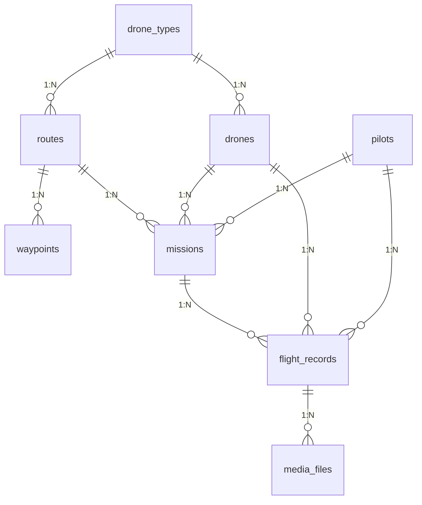

# 低空智能巡检平台 - 逻辑数据模型

## 数据库

PostgreSQL

---

## 1. 表结构概览

| 序号 | 表名           | 中文名       | 说明                     |
| ---- | -------------- | ------------ | ------------------------ |
| 1    | drone_types    | 无人机类型表 | 存储无人机型号信息       |
| 2    | drones         | 无人机表     | 存储具体的无人机设备     |
| 3    | pilots         | 飞手表       | 存储飞行操作员信息       |
| 4    | routes         | 航线表       | 存储航线规划信息         |
| 5    | waypoints      | 航点表       | 存储航线中的航点详情     |
| 6    | missions       | 任务表       | 存储巡检任务信息         |
| 7    | flight_records | 飞行记录表   | 存储每次飞行的执行记录   |
| 8    | media_files    | 媒体文件表   | 存储飞行拍摄的照片和视频 |

---

## 2. 表结构详情

### 2.1 drone_types（无人机类型表）

| 字段名       | 类型         | 约束     | 说明                              |
| ------------ | ------------ | -------- | --------------------------------- |
| id           | bigserial    | PK       | 类型ID                            |
| name         | varchar(100) | NOT NULL | 型号名称，如：大疆Mavic 3E、CW-15 |
| manufacturer | varchar(100) |          | 制造商                            |

---

### 2.2 drones（无人机表）

| 字段名        | 类型         | 约束                | 说明                                             |
| ------------- | ------------ | ------------------- | ------------------------------------------------ |
| id            | bigserial    | PK                  | 无人机ID                                         |
| name          | varchar(100) | NOT NULL            | 名称，如：应急测绘-01、河道巡检-03               |
| sn            | varchar(100) | UNIQUE              | 设备序列号                                       |
| drone_type_id | bigint       | FK → drone_types.id | 无人机类型ID                                     |
| status        | smallint     | DEFAULT 1           | 状态：1-在线, 2-离线, 3-故障, 4-维护中, 9-已报废 |
| created_at    | timestamp    | DEFAULT now()       | 创建时间                                         |
| updated_at    | timestamp    |                     | 更新时间                                         |

---

### 2.3 pilots（飞手表）

| 字段名           | 类型         | 约束          | 说明                                             |
| ---------------- | ------------ | ------------- | ------------------------------------------------ |
| id               | bigserial    | PK            | 飞手ID                                           |
| username         | varchar(50)  | NOT NULL      | 用户账号                                         |
| name             | varchar(50)  | NOT NULL      | 姓名                                             |
| phone            | varchar(20)  |               | 联系电话                                         |
| cert_type        | smallint     |               | 证件类型：1-AOPA合格证, 2-ALPA合格证, 3-CAAC执照 |
| cert_no          | varchar(100) |               | 证件编号                                         |
| cert_issue_date  | date         |               | 发证日期                                         |
| cert_expiry_date | date         |               | 有效期限                                         |
| account_status   | smallint     | DEFAULT 1     | 账号状态：1-开启, 0-关闭（含离职/已删除）        |
| created_at       | timestamp    | DEFAULT now() | 创建时间                                         |
| updated_at       | timestamp    |               | 更新时间                                         |

---

### 2.4 routes（航线表）

| 字段名             | 类型          | 约束                | 说明                             |
| ------------------ | ------------- | ------------------- | -------------------------------- |
| id                 | bigserial     | PK                  | 航线ID                           |
| name               | varchar(100)  | NOT NULL            | 航线名称                         |
| route_type         | smallint      | NOT NULL            | 航线类型：1-点状, 2-环状, 3-面状 |
| drone_type_id      | bigint        | FK → drone_types.id | 适用无人机类型ID                 |
| total_distance     | numeric(12,2) |                     | 航线总长度（米）                 |
| estimated_duration | integer       |                     | 预计飞行时长（秒）               |
| waypoint_count     | integer       |                     | 航点数量                         |
| creator_name       | varchar(50)   |                     | 创建人姓名                       |
| status             | smallint      | DEFAULT 1           | 状态：1-正常, 0-禁用（已删除）   |
| created_at         | timestamp     | DEFAULT now()       | 创建时间                         |
| updated_at         | timestamp     |                     | 更新时间                         |

---

### 2.5 waypoints（航点表）

| 字段名     | 类型          | 约束                     | 说明           |
| ---------- | ------------- | ------------------------ | -------------- |
| id         | bigserial     | PK                       | 航点ID         |
| route_id   | bigint        | FK → routes.id, NOT NULL | 所属航线ID     |
| sequence   | integer       | NOT NULL                 | 航点序号       |
| latitude   | numeric(12,8) | NOT NULL                 | 纬度           |
| longitude  | numeric(12,8) | NOT NULL                 | 经度           |
| altitude   | numeric(10,2) | NOT NULL                 | 飞行高度（米） |
| created_at | timestamp     | DEFAULT now()            | 创建时间       |

**索引**：(route_id, sequence) UNIQUE

---

### 2.6 missions（任务表）

| 字段名       | 类型         | 约束           | 说明                                                               |
| ------------ | ------------ | -------------- | ------------------------------------------------------------------ |
| id           | bigserial    | PK             | 任务ID                                                             |
| name         | varchar(100) | NOT NULL       | 任务名称                                                           |
| route_id     | bigint       | FK → routes.id | 任务航线ID                                                         |
| route_name   | varchar(100) |                | 航线名称（冗余）                                                   |
| drone_id     | bigint       | FK → drones.id | 执行无人机ID                                                       |
| drone_name   | varchar(100) |                | 无人机名称（冗余）                                                 |
| pilot_id     | bigint       | FK → pilots.id | 执行飞手ID                                                         |
| pilot_name   | varchar(50)  |                | 飞手姓名（冗余）                                                   |
| scheduled_at | timestamp    |                | 计划执行时间                                                       |
| remark       | varchar(500) |                | 任务备注                                                           |
| status       | smallint     | DEFAULT 0      | 状态：0-待执行, 1-执行中, 2-已暂停, 3-已完成, 4-已取消, 5-执行失败 |
| created_at   | timestamp    | DEFAULT now()  | 创建时间                                                           |
| updated_at   | timestamp    |                | 更新时间                                                           |

---

### 2.7 flight_records（飞行记录表）

| 字段名          | 类型         | 约束             | 说明                                 |
| --------------- | ------------ | ---------------- | ------------------------------------ |
| id              | bigserial    | PK               | 记录ID                               |
| flight_no       | varchar(50)  | UNIQUE, NOT NULL | 架次编号，如：YJ202511163281         |
| mission_id      | bigint       | FK → missions.id | 所属任务ID                           |
| mission_name    | varchar(100) |                  | 任务名称（冗余）                     |
| route_name      | varchar(100) |                  | 航线名称（冗余）                     |
| airport_name    | varchar(100) |                  | 执行机场名称                         |
| drone_id        | bigint       | FK → drones.id   | 执行无人机ID                         |
| drone_name      | varchar(100) |                  | 无人机名称（冗余）                   |
| pilot_id        | bigint       | FK → pilots.id   | 执行飞手ID                           |
| pilot_name      | varchar(50)  |                  | 飞手姓名（冗余）                     |
| start_time      | timestamp    |                  | 开始时间                             |
| end_time        | timestamp    |                  | 结束时间                             |
| flight_duration | integer      |                  | 飞行时长（秒）                       |
| photo_count     | integer      | DEFAULT 0        | 拍摄照片数量                         |
| video_count     | integer      | DEFAULT 0        | 录制视频数量                         |
| status          | smallint     | DEFAULT 0        | 状态：0-飞行中, 1-已完成, 2-异常终止 |
| created_at      | timestamp    | DEFAULT now()    | 创建时间                             |
| updated_at      | timestamp    |                  | 更新时间                             |

---

### 2.8 media_files（媒体文件表）

| 字段名           | 类型          | 约束                   | 说明                     |
| ---------------- | ------------- | ---------------------- | ------------------------ |
| id               | bigserial     | PK                     | 媒体ID                   |
| flight_record_id | bigint        | FK → flight_records.id | 关联飞行记录ID           |
| media_type       | smallint      | NOT NULL               | 媒体类型：1-照片, 2-视频 |
| file_name        | varchar(255)  | NOT NULL               | 文件名                   |
| file_url         | varchar(500)  | NOT NULL               | 文件URL                  |
| thumbnail_url    | varchar(500)  |                        | 缩略图URL                |
| file_size        | bigint        |                        | 文件大小（字节）         |
| latitude         | numeric(12,8) |                        | 拍摄位置-纬度            |
| longitude        | numeric(12,8) |                        | 拍摄位置-经度            |
| captured_at      | timestamp     |                        | 拍摄时间                 |
| is_deleted       | boolean       | DEFAULT false          | 是否已删除               |
| deleted_at       | timestamp     |                        | 删除时间                 |
| created_at       | timestamp     | DEFAULT now()          | 创建时间                 |

---

## 3. 关系图

