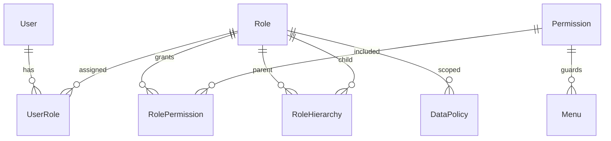

# 低空智能巡检平台 RBAC 权限管理设计（DRF）

## 1. 业务分析

基于 `逻辑设计/` 中的数据模型与数据字典，当前核心业务链路可概括为：

1. 维护基础资源：无人机类型、无人机、飞手。
2. 维护作业模板：航线与航点。
3. 下发与调度任务：基于航线、无人机、飞手创建任务并变更任务状态。
4. 执行与留痕：任务执行形成飞行记录（架次）。
5. 结果资产沉淀：飞行过程产生照片/视频等媒体文件。

### 1.1 核心业务流程（文字+流程图）

### 1.2 关键权限控制节点

- 基础档案节点：`drone_types`、`drones`、`pilots` 的增删改查。
- 航线节点：`routes`、`waypoints` 的创建、编辑、禁用、删除。
- 任务节点：`missions` 的创建、分配、启动、暂停、取消、完成确认。
- 飞行节点：`flight_records` 的查看与状态确认（异常终止、完结）。
- 媒体节点：`media_files` 的查看、下载、逻辑删除、恢复、清理。
- 管理节点：角色授权、权限分配、数据范围策略配置。

---

## 2. RBAC 架构设计（框架无关）

### 2.1 设计目标

- 遵循 RBAC 标准模型（用户-角色-权限）。
- 支持角色层级（父子角色继承）。
- 支持权限动态扩展（新增资源或动作无需改动主流程）。
- 支持功能权限与数据权限分离。
- 适配 API 级与数据级双层校验。

### 2.2 核心实体

- **User（用户）**：系统登录主体。
- **Role（角色）**：权限集合载体，如系统管理员、调度员、飞手、审计员。
- **Permission（权限）**：最小授权单元，建议以 `资源+动作` 建模。
- **RoleHierarchy（角色层级）**：角色继承关系。
- **UserRole（用户-角色关联）**：支持多角色。
- **RolePermission（角色-权限关联）**：支持多权限。
- **Menu（菜单/功能点）**：前端导航资源，与权限建立可见性映射。
- **DataPolicy（数据权限策略）**：定义数据可见范围（全部、本部门、本人、指定区域等）。

### 2.3 实体关系

关系说明：

1. 用户与角色为多对多，满足一人多岗。
2. 角色与权限为多对多，支持组合授权。
3. 角色层级使上级角色自动继承下级角色权限。
4. 权限与菜单可一对多或多对多映射，支持页面与按钮级可见控制。
5. 数据权限通过角色绑定策略，不直接硬编码在功能权限中。

### 2.4 权限粒度与扩展机制

#### API/功能权限（粗到细）

- 模块级：如 `mission:*`。
- 资源动作级：如 `mission:create`、`mission:start`、`route:disable`。
- 特殊操作级：如 `media:purge`（物理清理）、`auth:grant`（授权管理）。

#### 数据权限（行级）

- 全部数据。
- 本部门/本区域数据。
- 本人创建或本人执行数据。
- 自定义表达式（用于未来扩展更复杂规则）。

#### 动态扩展

- 新增业务资源时，只需新增 Permission 记录与角色绑定，不修改授权主模型。
- 新增角色时，只需配置角色层级、角色权限、数据策略。
- 通过“权限字典 + 策略表”支持平滑演进。

---

## 3. Django REST Framework 落地方案

> 仅描述实现思路，不包含具体代码。

### 3.1 模型设计思路

建议在业务表之外新增“统一权限域”：

- 用户模型可复用 Django `User`（或自定义扩展）。
- 角色、权限、用户角色、角色权限、角色继承、数据策略分别建模。
- 权限编码采用统一命名规范：`{resource}:{action}`，如 `flight_record:view`。
- 数据策略与角色关联，同时可挂接作用域字段（部门ID、区域编码、人员ID等）。

### 3.2 与 DRF 权限体系集成

- 认证层：复用 DRF Authentication（Session/JWT/Token 均可）。
- 授权层：
  - 在 `BasePermission` 自定义类中实现功能权限校验。
  - 在 ViewSet 的 action 维度配置所需权限编码。
  - 对对象级访问（`has_object_permission`）叠加数据策略判断。
- 数据过滤层：在 queryset 构建阶段注入“数据权限过滤器”，保证列表与详情一致。

### 3.3 API 权限控制策略

1. **请求进入**：认证通过后获取用户全部角色（含继承展开）。
2. **功能校验**：验证是否具备当前 API/action 所需权限编码。
3. **数据校验**：根据角色绑定的数据策略收敛可访问数据范围。
4. **操作留痕**：对授权失败、敏感操作（授权变更、物理删除）记录审计日志。

建议采用“白名单声明式”策略：每个 API 显式声明权限需求，避免隐式放行。

### 3.4 关键技术难点与解决思路

- **难点1：角色继承带来的权限聚合复杂度**  
  解决：角色继承结果可缓存（短 TTL），并在角色变更后主动失效。

- **难点2：功能权限与数据权限混用导致逻辑膨胀**  
  解决：坚持“双层校验”，功能权限在 Permission Class，数据权限在 QuerySet/对象级过滤。

- **难点3：高频接口权限判断性能**  
  解决：权限编码集合缓存 + 数据策略模板化 + 避免重复查询。

- **难点4：媒体与飞行记录等敏感数据合规**  
  解决：逻辑删除、下载控制、审计日志与定期清理策略联动。

---

## 4. 扩展性说明

- **业务扩展**：新增巡检对象（如基站、桥梁）时，仅新增资源权限与策略映射。
- **组织扩展**：支持多租户/多部门时，数据策略可增加租户维度。
- **管理扩展**：菜单、按钮、API 可统一挂接权限编码，前后端一致。
- **安全扩展**：后续可叠加审批授权、临时授权、最小权限推荐策略。

## 5. 建议的初始角色样例（示意）

- 系统管理员：全量功能 + 全部数据。
- 调度员：任务/航线管理 + 指定区域数据。
- 飞手：任务执行、飞行记录回传 + 本人任务数据。
- 监管审计员：只读查看 + 全部或指定区域数据。

以上方案与现有业务实体保持一致，可在不改动核心业务模型的前提下逐步落地。
