# 低空平台 - 概念设计（ER图 / Current）

> 本文档对齐当前代码中已落地的正式 `/api/v1/*` 实现。
> 当前系统由 Formal IAM Plane 与 Business API Plane 组成，并统一通过 `/api/v1/docs/` 暴露文档。

## 涉及模块

- 正式 IAM 会话与身份
- 平台治理
- 租户成员与角色
- 无人机台账
- 无人机分配
- 航线与航点
- 任务管理
- 飞行记录
- 媒体文件

---

## 1. 实体识别

| 实体 | 英文名 | 说明 | 来源页面 |
| ---- | ------ | ---- | -------- |
| **账号** | User | 系统登录账号主体 | `session/*`、Admin |
| **人员档案** | StaffProfile | 账号绑定的全局人员档案 | `me/*`、Admin |
| **认证会话** | AuthSession | 正式 Bearer Token 会话 | `session/*` |
| **租户** | Tenant | 平台治理的租户主实体 | `platform/*` |
| **租户成员** | TenantMember | 账号进入租户后的成员关系 | `tenant/*` |
| **成员角色绑定** | TenantMemberRole | 租户成员与平台角色的绑定关系 | `tenant/*` |
| **平台角色** | Role | 平台统一角色目录 | `platform/*`、`tenant/*` |
| **平台权限** | Permission | 平台统一权限目录 | `platform/*` |
| **角色权限映射** | RolePermissionGrant | 角色与权限、scope 的基线映射 | 平台权限基线 |
| **资质类型** | QualificationType | 平台统一资质类型目录 | Admin |
| **成员资质** | TenantMemberQualification | 租户成员资质记录 | Admin |
| **审计日志** | AuditLog | 平台级 / 租户级关键操作审计 | `platform/*`、`tenant/*` |
| **无人机** | Drone | 租户内无人机台账 | `drones/*` |
| **无人机分配** | DroneAssignment | 无人机与飞手成员的分配关系 | `drone-assignments/*` |
| **航线** | Route | 租户内航线台账 | `routes/*` |
| **航点** | Waypoint | 航线内部航点结构，不再独立对外开放 | `routes/*` |
| **任务** | Mission | 租户内巡检任务 | `missions/*` |
| **飞行记录** | FlightRecord | 任务执行过程中的飞行记录 | `flight-records/*` |
| **媒体文件** | MediaFile | 飞行过程产生的图片与视频 | `media-files/*` |

---

## 2. ER图（Mermaid）

```mermaid
erDiagram
    %% ========== 实体定义 ==========

    User_账号 {
        bigint id PK "账号ID"
        string username "登录账号"
        bool is_platform_admin "是否平台工作态"
        int status "账号状态"
    }

    StaffProfile_人员档案 {
        bigint id PK "人员档案ID"
        string name "姓名"
        string phone "手机号"
        int employment_status "在职状态"
    }

    AuthSession_认证会话 {
        bigint id PK "会话ID"
        string session_type "BUSINESS/PLATFORM"
        datetime access_token_expires_at "access 过期时间"
        datetime refresh_token_expires_at "refresh 过期时间"
    }

    Tenant_租户 {
        bigint id PK "租户ID"
        string code "租户编码"
        string name "租户名称"
        int status "租户状态"
    }

    TenantMember_租户成员 {
        bigint id PK "成员关系ID"
        string member_no "租户内工号"
        string display_name "显示名称"
        int status "成员状态"
    }

    TenantMemberRole_成员角色绑定 {
        bigint id PK "绑定ID"
        int status "GRANTED/REVOKED"
        datetime assigned_at "分配时间"
    }

    Role_平台角色 {
        bigint id PK "角色ID"
        string code "角色编码"
        string name "角色名称"
        int status "目录状态"
    }

    Permission_平台权限 {
        bigint id PK "权限ID"
        string code "权限编码"
        string module "模块"
        string resource_code "资源编码"
    }

    RolePermissionGrant_角色权限映射 {
        bigint id PK "映射ID"
        string scope_type "ALL/OWN/ASSIGNED"
    }

    QualificationType_资质类型 {
        bigint id PK "资质类型ID"
        string code "资质编码"
        string name "资质名称"
        bool requires_validity "是否要求有效期"
    }

    TenantMemberQualification_成员资质 {
        bigint id PK "资质记录ID"
        string certificate_no "证书编号"
        int status "资质状态"
        date valid_until "有效截止日期"
    }

    AuditLog_审计日志 {
        bigint id PK "日志ID"
        string action "动作码"
        string target_type "目标类型"
        datetime created_at "记录时间"
    }

    Drone_无人机 {
        bigint id PK "无人机ID"
        string code "业务编码"
        string model "型号"
        string device_sn "设备序列号"
        string status "状态"
    }

    DroneAssignment_无人机分配 {
        bigint id PK "分配ID"
        string status "ACTIVE/INACTIVE"
        datetime start_at "开始时间"
        datetime end_at "结束时间"
    }

    Route_航线 {
        bigint id PK "航线ID"
        string name "航线名称"
        int route_type "扩展位"
    }

    Waypoint_航点 {
        bigint id PK "航点ID"
        int sequence "序号"
        decimal latitude "纬度"
        decimal longitude "经度"
    }

    Mission_任务 {
        bigint id PK "任务ID"
        string name "任务名称"
        int status "任务状态"
        datetime scheduled_at "计划执行时间"
    }

    FlightRecord_飞行记录 {
        bigint id PK "记录ID"
        string flight_no "架次编号"
        int status "飞行状态"
        int flight_duration "飞行时长"
    }

    MediaFile_媒体文件 {
        bigint id PK "媒体ID"
        int media_type "照片/视频"
        string file_name "文件名"
        bool is_deleted "是否逻辑删除"
    }

    %% ========== 关系定义 ==========

    User_账号 ||--|| StaffProfile_人员档案 : "绑定 (1:1)"
    User_账号 ||--o{ AuthSession_认证会话 : "建立会话 (1:N)"
    Tenant_租户 ||--o{ TenantMember_租户成员 : "拥有成员 (1:N)"
    User_账号 ||--o{ TenantMember_租户成员 : "加入租户 (1:N)"
    TenantMember_租户成员 ||--o{ TenantMemberQualification_成员资质 : "拥有资质 (1:N)"
    QualificationType_资质类型 ||--o{ TenantMemberQualification_成员资质 : "约束资质 (1:N)"
    TenantMember_租户成员 ||--o{ DroneAssignment_无人机分配 : "被分配无人机 (1:N)"
    Drone_无人机 ||--o{ DroneAssignment_无人机分配 : "被分配给成员 (1:N)"
    TenantMember_租户成员 ||--o{ Mission_任务 : "执行任务 (1:N)"
    TenantMember_租户成员 ||--o{ FlightRecord_飞行记录 : "执行飞行 (1:N)"
    TenantMember_租户成员 ||--o{ TenantMemberRole_成员角色绑定 : "绑定角色 (1:N)"
    Role_平台角色 ||--o{ TenantMemberRole_成员角色绑定 : "分配给成员 (1:N)"
    Role_平台角色 ||--o{ RolePermissionGrant_角色权限映射 : "授予权限 (1:N)"
    Permission_平台权限 ||--o{ RolePermissionGrant_角色权限映射 : "被角色引用 (1:N)"
    Tenant_租户 ||--o{ AuditLog_审计日志 : "产生审计 (1:N)"
    User_账号 ||--o{ AuditLog_审计日志 : "发起操作 (1:N)"
    Tenant_租户 ||--o{ Drone_无人机 : "管理无人机 (1:N)"
    Tenant_租户 ||--o{ Route_航线 : "管理航线 (1:N)"
    Route_航线 ||--o{ Waypoint_航点 : "包含内部航点 (1:N)"
    Tenant_租户 ||--o{ Mission_任务 : "管理任务 (1:N)"
    Route_航线 ||--o{ Mission_任务 : "任务使用航线 (1:N)"
    Drone_无人机 ||--o{ Mission_任务 : "任务绑定无人机 (1:N)"
    Tenant_租户 ||--o{ FlightRecord_飞行记录 : "沉淀飞行记录 (1:N)"
    Mission_任务 ||--o{ FlightRecord_飞行记录 : "产生飞行记录 (1:N)"
    Drone_无人机 ||--o{ FlightRecord_飞行记录 : "参与飞行 (1:N)"
    Tenant_租户 ||--o{ MediaFile_媒体文件 : "拥有媒体文件 (1:N)"
    FlightRecord_飞行记录 ||--o{ MediaFile_媒体文件 : "产生媒体文件 (1:N)"
```



---

## 3. 实体关系说明

| 关系 | 基数 | 说明 |
| ---- | ---- | ---- |
| User — StaffProfile | 1:1 | 一个账号最多绑定一条全局人员档案 |
| User — AuthSession | 1:N | 一个账号可持有多条 Bearer 会话 |
| Tenant — TenantMember | 1:N | 一个租户下有多条成员关系 |
| User — TenantMember | 1:N | 一个账号可加入多个租户 |
| TenantMember — TenantMemberRole | 1:N | 一个成员可绑定多个平台角色 |
| Role — TenantMemberRole | 1:N | 一个平台角色可分配给多个租户成员 |
| Role — Permission | N:N | 通过 `RolePermissionGrant` 建立权限与 scope 基线 |
| TenantMember — TenantMemberQualification | 1:N | 一个成员可拥有多条资质记录 |
| QualificationType — TenantMemberQualification | 1:N | 一个资质类型可约束多条资质记录 |
| Tenant — Drone | 1:N | 无人机台账按租户隔离 |
| Drone — DroneAssignment | 1:N | 一架无人机可形成多条历史分配记录 |
| TenantMember — DroneAssignment | 1:N | 一个飞手成员可拥有多条历史分配记录 |
| Tenant — Route | 1:N | 航线按租户隔离 |
| Route — Waypoint | 1:N | 一条航线包含多个内部航点；当前不再单独暴露 waypoint 资源 |
| Route — Mission | 1:N | 一条航线可被多个任务复用 |
| Drone — Mission | 1:N | 一架无人机可执行多个任务 |
| TenantMember — Mission | 1:N | 飞手成员可执行多个任务 |
| Mission — FlightRecord | 1:N | 一个任务可产生多条飞行记录 |
| FlightRecord — MediaFile | 1:N | 一条飞行记录可沉淀多个媒体文件 |
| Tenant — AuditLog | 1:N | 租户级审计按租户归档 |
| User — AuditLog | 1:N | 审计记录保留操作账号 |

---

## 4. 核心业务流程

```
账号登录 → 进入平台/租户工作态 → 资源治理与分配 → 任务执行 → 记录与媒体沉淀
   │               │                   │               │              │
   ▼               ▼                   ▼               ▼              ▼
 session/*     me/* / tenant/* /   drones/routes/    missions      flight_records/
               platform/*          drone-assignments                media_files
```
