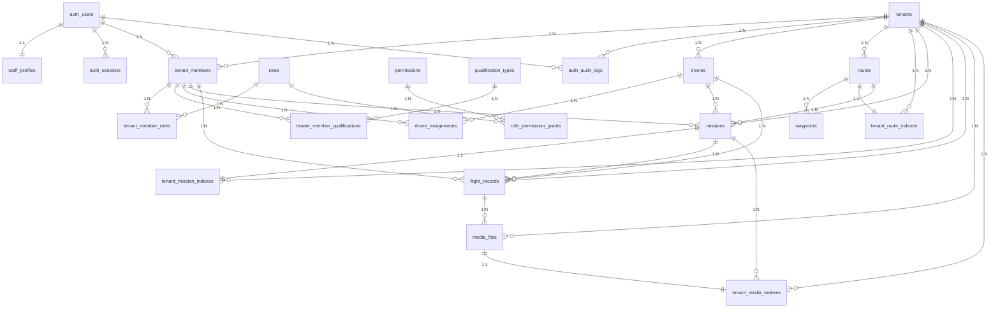

# 低空平台 - 逻辑数据模型

## 数据库

PostgreSQL

---

## 1. 表结构概览

> 当前总览对齐正式 `/api/v1/*` 实现，覆盖 Formal IAM Plane、Business API Plane 与 DJI 适配层的核心表，不展开 Django 内部运行表。

| 序号 | 表名 | 中文名 | 说明 |
| ---- | ---- | ---- | ---- |
| 1 | auth_users | 账号表 | 平台登录账号主体 |
| 2 | auth_sessions | 认证会话表 | 正式 Bearer 会话 |
| 3 | staff_profiles | 人员档案表 | 账号绑定的全局人员档案 |
| 4 | tenants | 租户表 | 平台治理的租户主实体 |
| 5 | roles | 平台角色目录 | 平台统一角色字典 |
| 6 | permissions | 平台权限目录 | 平台统一权限字典 |
| 7 | role_permission_grants | 角色权限映射表 | 角色到权限与 scope 的基线映射 |
| 8 | qualification_types | 资质类型表 | 平台统一资质类型字典 |
| 9 | tenant_members | 租户成员关系表 | 账号进入租户后的成员主体 |
| 10 | tenant_member_roles | 成员角色绑定表 | 租户成员与平台角色的绑定 |
| 11 | tenant_member_qualifications | 成员资质记录表 | 租户成员的资质信息 |
| 12 | auth_audit_logs | 审计日志表 | 平台级 / 租户级关键动作审计 |
| 13 | drones | 无人机表 | 租户内无人机台账 |
| 14 | drone_assignments | 无人机分配表 | 无人机与飞手成员的分配关系 |
| 15 | routes | 航线表 | 租户内航线台账 |
| 16 | waypoints | 航点表 | Route 聚合内部航点表 |
| 17 | missions | 任务表 | 巡检任务主记录 |
| 18 | flight_records | 飞行记录表 | 飞行执行过程记录 |
| 19 | media_files | 媒体文件表 | 飞行过程产生的图片与视频 |
| 20 | dji_workspace_configs | DJI 工作空间配置表 | 系统托管的 DJI workspace / user 会话 |
| 21 | dji_device_indexes | DJI 设备索引表 | 共享设备池快照 |
| 22 | tenant_route_indexes | 航线发布索引表 | route 与 DJI 航线映射 |
| 23 | tenant_mission_indexes | 任务同步索引表 | mission 与 DJI job 映射 |
| 24 | tenant_media_indexes | 媒体同步索引表 | media_file 与 DJI 文件映射 |

补充说明：
1. 当前实现不存在独立 `drone_types` 表。
2. 当前实现不存在独立 `pilots` 表，飞手统一建模为 `tenant_members` 中拥有 `pilot_operator` 角色的成员。
3. `routes.drone_type_id` 当前只是预留的原始 bigint 字段，没有外键指向。

---

## 2. 表结构详情

### 2.1 auth_users（账号表）

| 字段名 | 类型 | 约束 | 说明 |
| ------ | ---- | ---- | ---- |
| id | bigserial | PK | 账号 ID |
| username | varchar(150) | NOT NULL, UNIQUE | 登录账号 |
| is_staff | boolean | NOT NULL, DEFAULT false | 是否可登录 Django Admin |
| is_active | boolean | NOT NULL, DEFAULT true | Django 账户启用状态 |
| is_superuser | boolean | NOT NULL, DEFAULT false | 技术 Root 标记 |
| is_platform_admin | boolean | NOT NULL, DEFAULT false | 是否平台工作态账号 |
| status | smallint | NOT NULL, DEFAULT 1 | 业务账号状态：1-active, 0-disabled |
| last_login | timestamp |  | 最近登录时间 |
| created_at | timestamp | NOT NULL, DEFAULT now() | 创建时间 |
| updated_at | timestamp | NOT NULL, DEFAULT now() | 更新时间 |

说明：
1. `superuser` 与 `platform_admin` 不能同时为 true。
2. 当前实现保留 Django `groups` 与 `user_permissions` 兼容关系，但业务规则禁止直接作为正式授权入口。

---

### 2.2 auth_sessions（认证会话表）

| 字段名 | 类型 | 约束 | 说明 |
| ------ | ---- | ---- | ---- |
| id | bigserial | PK | 会话 ID |
| user_id | bigint | NOT NULL, FK -> auth_users.id | 关联账号 |
| session_type | varchar(16) | NOT NULL | 会话类型：`BUSINESS / PLATFORM` |
| access_token_hash | varchar(64) | NOT NULL, UNIQUE | access token 哈希 |
| refresh_token_hash | varchar(64) | NOT NULL, UNIQUE | refresh token 哈希 |
| access_token_expires_at | timestamp | NOT NULL | access token 过期时间 |
| refresh_token_expires_at | timestamp | NOT NULL | refresh token 过期时间 |
| revoked_at | timestamp |  | 撤销时间 |
| last_refreshed_at | timestamp |  | 最近刷新时间 |
| last_used_at | timestamp |  | 最近使用时间 |
| created_ip | inet / varchar |  | 创建 IP |
| last_used_ip | inet / varchar |  | 最近使用 IP |
| user_agent | varchar(255) | NOT NULL, DEFAULT '' | 客户端标识 |
| created_at | timestamp | NOT NULL, DEFAULT now() | 创建时间 |
| updated_at | timestamp | NOT NULL, DEFAULT now() | 更新时间 |

说明：正式 `/api/v1/*` Bearer Token 会话由该表承载。

---

### 2.3 staff_profiles（人员档案表）

| 字段名 | 类型 | 约束 | 说明 |
| ------ | ---- | ---- | ---- |
| id | bigserial | PK | 人员档案 ID |
| user_id | bigint | NOT NULL, UNIQUE, FK -> auth_users.id | 关联账号（1:1） |
| name | varchar(64) | NOT NULL | 姓名 |
| phone | varchar(32) |  | 手机号 |
| email | varchar(254) |  | 邮箱 |
| employment_status | smallint | NOT NULL, DEFAULT 1 | 在职状态：1-active, 0-inactive |
| org_id | bigint |  | 组织 ID |
| created_at | timestamp | NOT NULL, DEFAULT now() | 创建时间 |
| updated_at | timestamp | NOT NULL, DEFAULT now() | 更新时间 |

说明：`staff_profiles` 只承载全局人员事实信息，不承载租户内工号、角色等字段。

---

### 2.4 tenants（租户表）

| 字段名 | 类型 | 约束 | 说明 |
| ------ | ---- | ---- | ---- |
| id | bigserial | PK | 租户 ID |
| code | varchar(64) | NOT NULL, UNIQUE | 租户编码 |
| name | varchar(128) | NOT NULL | 租户名称 |
| status | smallint | NOT NULL, DEFAULT 1 | 状态：1-active, 0-disabled |
| plan | varchar(64) | NOT NULL, DEFAULT '' | 套餐 |
| remark | varchar(500) | NOT NULL, DEFAULT '' | 备注 |
| created_at | timestamp | NOT NULL, DEFAULT now() | 创建时间 |
| updated_at | timestamp | NOT NULL, DEFAULT now() | 更新时间 |

---

### 2.5 roles（平台角色目录）

| 字段名 | 类型 | 约束 | 说明 |
| ------ | ---- | ---- | ---- |
| id | bigserial | PK | 角色 ID |
| code | varchar(64) | NOT NULL, UNIQUE | 角色编码 |
| name | varchar(128) | NOT NULL | 角色名称 |
| description | varchar(500) | NOT NULL, DEFAULT '' | 角色描述 |
| status | smallint | NOT NULL, DEFAULT 1 | 状态：1-active, 0-disabled |
| created_at | timestamp | NOT NULL, DEFAULT now() | 创建时间 |
| updated_at | timestamp | NOT NULL, DEFAULT now() | 更新时间 |

说明：当前种子角色为 `platform_admin`、`tenant_admin`、`business_admin`、`route_planner`、`dispatcher`、`pilot_operator`、`auditor`。

---

### 2.6 permissions（平台权限目录）

| 字段名 | 类型 | 约束 | 说明 |
| ------ | ---- | ---- | ---- |
| id | bigserial | PK | 权限 ID |
| code | varchar(128) | NOT NULL, UNIQUE | 权限编码 |
| name | varchar(128) | NOT NULL | 权限名称 |
| module | varchar(64) | NOT NULL | 模块名 |
| resource_code | varchar(64) | NOT NULL, DEFAULT '' | 资源编码 |
| description | varchar(500) | NOT NULL, DEFAULT '' | 描述 |
| status | smallint | NOT NULL, DEFAULT 1 | 状态：1-active, 0-disabled |
| created_at | timestamp | NOT NULL, DEFAULT now() | 创建时间 |
| updated_at | timestamp | NOT NULL, DEFAULT now() | 更新时间 |

说明：`permissions` 是正式授权目录，不是 Django `auth_permission`。

---

### 2.7 role_permission_grants（角色权限映射表）

| 字段名 | 类型 | 约束 | 说明 |
| ------ | ---- | ---- | ---- |
| id | bigserial | PK | 映射 ID |
| role_id | bigint | NOT NULL, FK -> roles.id | 角色 ID |
| permission_id | bigint | NOT NULL, FK -> permissions.id | 权限 ID |
| scope_type | varchar(16) | NOT NULL, DEFAULT 'ALL' | 范围：`ALL / OWN / ASSIGNED` |
| created_at | timestamp | NOT NULL, DEFAULT now() | 创建时间 |
| updated_at | timestamp | NOT NULL, DEFAULT now() | 更新时间 |

唯一约束：`(role_id, permission_id)`

---

### 2.8 qualification_types（资质类型表）

| 字段名 | 类型 | 约束 | 说明 |
| ------ | ---- | ---- | ---- |
| id | bigserial | PK | 资质类型 ID |
| code | varchar(64) | NOT NULL, UNIQUE | 资质编码 |
| name | varchar(128) | NOT NULL | 资质名称 |
| description | varchar(500) | NOT NULL, DEFAULT '' | 资质描述 |
| requires_validity | boolean | NOT NULL, DEFAULT false | 是否要求有效期 |
| payload_schema_json | json |  | 扩展字段 schema |
| status | smallint | NOT NULL, DEFAULT 1 | 状态：1-active, 0-disabled |
| created_at | timestamp | NOT NULL, DEFAULT now() | 创建时间 |
| updated_at | timestamp | NOT NULL, DEFAULT now() | 更新时间 |

---

### 2.9 tenant_members（租户成员关系表）

| 字段名 | 类型 | 约束 | 说明 |
| ------ | ---- | ---- | ---- |
| id | bigserial | PK | 成员关系 ID |
| tenant_id | bigint | NOT NULL, FK -> tenants.id | 所属租户 |
| user_id | bigint | NOT NULL, FK -> auth_users.id | 账号 ID |
| member_no | varchar(64) |  | 租户内工号 |
| display_name | varchar(128) | NOT NULL, DEFAULT '' | 显示名称 |
| invitation_token | varchar(64) |  | 邀请令牌 |
| invited_by_user_id | bigint | FK -> auth_users.id | 邀请人 |
| invited_at | timestamp |  | 邀请时间 |
| expires_at | timestamp |  | 过期时间 |
| responded_at | timestamp |  | 响应时间 |
| joined_at | timestamp |  | 加入时间 |
| status | smallint | NOT NULL, DEFAULT 0 | 状态：`INVITED / ACTIVE / REJECTED / EXPIRED / REVOKED / DISABLED` |
| created_at | timestamp | NOT NULL, DEFAULT now() | 创建时间 |
| updated_at | timestamp | NOT NULL, DEFAULT now() | 更新时间 |

约束：
1. 唯一约束：`(tenant_id, user_id)`。
2. `member_no` 在同租户内仅在非空时唯一。
3. `invitation_token` 在非空时唯一。

---

### 2.10 tenant_member_roles（成员角色绑定表）

| 字段名 | 类型 | 约束 | 说明 |
| ------ | ---- | ---- | ---- |
| id | bigserial | PK | 绑定 ID |
| tenant_member_id | bigint | NOT NULL, FK -> tenant_members.id | 成员关系 ID |
| system_role_id | bigint | NOT NULL, FK -> roles.id | 角色 ID |
| status | smallint | NOT NULL, DEFAULT 1 | 状态：`GRANTED / REVOKED` |
| assigned_by_user_id | bigint | FK -> auth_users.id | 分配人 |
| assigned_at | timestamp |  | 分配时间 |
| created_at | timestamp | NOT NULL, DEFAULT now() | 创建时间 |
| updated_at | timestamp | NOT NULL, DEFAULT now() | 更新时间 |

唯一约束：`(tenant_member_id, system_role_id)`

说明：`platform_admin` 不允许分配给租户成员。

---

### 2.11 tenant_member_qualifications（成员资质记录表）

| 字段名 | 类型 | 约束 | 说明 |
| ------ | ---- | ---- | ---- |
| id | bigserial | PK | 资质记录 ID |
| tenant_member_id | bigint | NOT NULL, FK -> tenant_members.id | 成员关系 ID |
| qualification_type_id | bigint | NOT NULL, FK -> qualification_types.id | 资质类型 ID |
| certificate_no | varchar(128) | NOT NULL, DEFAULT '' | 证书编号 |
| level | varchar(64) | NOT NULL, DEFAULT '' | 等级 |
| status | smallint | NOT NULL, DEFAULT 1 | 状态：`ACTIVE / INVALID / REVOKED` |
| issued_at | date |  | 发证日期 |
| valid_from | date |  | 有效开始日期 |
| valid_until | date |  | 有效截止日期 |
| issuer | varchar(128) | NOT NULL, DEFAULT '' | 发证机构 |
| payload_json | json | NOT NULL, DEFAULT {} | 扩展信息 |
| created_at | timestamp | NOT NULL, DEFAULT now() | 创建时间 |
| updated_at | timestamp | NOT NULL, DEFAULT now() | 更新时间 |

说明：资质类型若要求有效期，则 `valid_from` 与 `valid_until` 必填。

---

### 2.12 auth_audit_logs（审计日志表）

| 字段名 | 类型 | 约束 | 说明 |
| ------ | ---- | ---- | ---- |
| id | bigserial | PK | 日志 ID |
| tenant_id | bigint | FK -> tenants.id | 所属租户；平台级日志可为空 |
| actor_user_id | bigint | FK -> auth_users.id | 操作人账号 |
| action | varchar(128) | NOT NULL | 动作码 |
| target_type | varchar(128) | NOT NULL | 目标类型 |
| target_id | varchar(64) | NOT NULL, DEFAULT '' | 目标主键 |
| before_data | json |  | 变更前快照 |
| after_data | json |  | 变更后快照 |
| ip | varchar(39) |  | 请求 IP |
| request_id | varchar(64) | NOT NULL, DEFAULT '' | 请求追踪 ID |
| created_at | timestamp | NOT NULL, DEFAULT now() | 创建时间 |

---

### 2.13 drones（无人机表）

| 字段名 | 类型 | 约束 | 说明 |
| ------ | ---- | ---- | ---- |
| id | bigserial | PK | 无人机 ID |
| tenant_id | bigint | NOT NULL, FK -> tenants.id | 所属租户 |
| code | varchar(64) | NOT NULL | 租户内业务编码 |
| name | varchar(128) | NOT NULL | 无人机名称 |
| model | varchar(128) | NOT NULL | 型号 |
| device_sn | varchar(128) | NOT NULL | 设备序列号 |
| status | varchar(16) | NOT NULL, DEFAULT 'DISABLED' | 状态：`ENABLED / DISABLED` |
| org_id | bigint |  | 组织 ID |
| created_by_tenant_member_id | bigint |  | 创建人 TenantMember ID |
| created_at | timestamp | NOT NULL, DEFAULT now() | 创建时间 |
| updated_at | timestamp | NOT NULL, DEFAULT now() | 更新时间 |

约束：
1. 唯一约束：`(tenant_id, code)`。
2. 唯一约束：`(tenant_id, device_sn)`。
3. `status` 仅作为当前同步周期下的在线摘要，由后台同步任务写入。

---

### 2.14 drone_assignments（无人机分配表）

| 字段名 | 类型 | 约束 | 说明 |
| ------ | ---- | ---- | ---- |
| id | bigserial | PK | 分配 ID |
| tenant_id | bigint | NOT NULL, FK -> tenants.id | 所属租户 |
| drone_id | bigint | NOT NULL, FK -> drones.id | 无人机 ID |
| tenant_member_id | bigint | NOT NULL, FK -> tenant_members.id | 飞手成员 ID |
| status | varchar(16) | NOT NULL, DEFAULT 'ACTIVE' | 分配状态：`ACTIVE / INACTIVE` |
| start_at | timestamp | NOT NULL, DEFAULT now() | 开始时间 |
| end_at | timestamp |  | 结束时间 |
| created_by_tenant_member_id | bigint |  | 创建人 TenantMember ID |
| created_at | timestamp | NOT NULL, DEFAULT now() | 创建时间 |
| updated_at | timestamp | NOT NULL, DEFAULT now() | 更新时间 |

说明：当前实现只允许把无人机分配给当前租户下、在职且拥有 `pilot_operator` 角色的 ACTIVE 成员。

---

### 2.15 routes（航线表）

| 字段名 | 类型 | 约束 | 说明 |
| ------ | ---- | ---- | ---- |
| id | bigserial | PK | 航线 ID |
| tenant_id | bigint | NOT NULL, FK -> tenants.id | 所属租户 |
| name | varchar(100) | NOT NULL | 航线名称 |
| route_type | smallint | NOT NULL, DEFAULT 0 | 航线类型扩展位：当前仅 `0-待扩展` |
| drone_type_id | bigint |  | 适用无人机类型 ID（预留字段，无外键） |
| total_distance | numeric(12,2) |  | 航线总长度（米） |
| estimated_duration | integer |  | 预计飞行时长（秒） |
| waypoint_count | integer |  | 航点数量 |
| creator_name | varchar(50) | NOT NULL, DEFAULT '' | 创建人姓名 |
| created_at | timestamp | NOT NULL, DEFAULT now() | 创建时间 |
| updated_at | timestamp | NOT NULL, DEFAULT now() | 更新时间 |

说明：
1. 当前设计不再使用 `Route.status`。
2. `Route` 是公开聚合根，航点通过 `waypoints[]` 作为内部编辑结构读写。

---

### 2.16 waypoints（航点表）

| 字段名 | 类型 | 约束 | 说明 |
| ------ | ---- | ---- | ---- |
| id | bigserial | PK | 航点 ID |
| route_id | bigint | NOT NULL, FK -> routes.id | 所属航线 |
| sequence | integer | NOT NULL | 航点序号 |
| latitude | numeric(12,8) | NOT NULL | 纬度 |
| longitude | numeric(12,8) | NOT NULL | 经度 |
| altitude | numeric(10,2) | NOT NULL | 飞行高度（米） |
| created_at | timestamp | NOT NULL, DEFAULT now() | 创建时间 |

唯一约束：`(route_id, sequence)`

说明：`waypoints` 只作为 `Route` 聚合的内部持久化结构，不再存在独立 waypoint 业务 API。

---

### 2.17 missions（任务表）

| 字段名 | 类型 | 约束 | 说明 |
| ------ | ---- | ---- | ---- |
| id | bigserial | PK | 任务 ID |
| tenant_id | bigint | NOT NULL, FK -> tenants.id | 所属租户 |
| name | varchar(100) | NOT NULL | 任务名称 |
| route_id | bigint | FK -> routes.id | 任务航线；route 删除后可为空 |
| route_name | varchar(100) | NOT NULL, DEFAULT '' | 航线名称冗余 |
| drone_id | bigint | NOT NULL, FK -> drones.id | 执行无人机 |
| drone_name | varchar(100) | NOT NULL, DEFAULT '' | 无人机名称冗余 |
| pilot_id | bigint | NOT NULL, FK -> tenant_members.id | 执行飞手成员 |
| pilot_name | varchar(50) | NOT NULL, DEFAULT '' | 飞手姓名冗余 |
| scheduled_at | timestamp |  | 计划执行时间 |
| remark | varchar(500) | NOT NULL, DEFAULT '' | 任务备注 |
| status | smallint | NOT NULL, DEFAULT 0 | 状态：`PENDING / RUNNING / PAUSED / COMPLETED / CANCELED / FAILED` |
| dji_job_id | varchar(128) | NOT NULL, DEFAULT '' | DJI 任务 ID |
| created_at | timestamp | NOT NULL, DEFAULT now() | 创建时间 |
| updated_at | timestamp | NOT NULL, DEFAULT now() | 更新时间 |

说明：
1. 飞手字段不是独立 `pilot` 表，而是 `tenant_members` 中拥有 `pilot_operator` 角色的成员。
2. 创建 mission 时要求 route 已发布到 DJI；本地 `start / pause / resume / complete / fail` 动作接口已删除。

---

### 2.18 flight_records（飞行记录表）

| 字段名 | 类型 | 约束 | 说明 |
| ------ | ---- | ---- | ---- |
| id | bigserial | PK | 记录 ID |
| tenant_id | bigint | NOT NULL, FK -> tenants.id | 所属租户 |
| flight_no | varchar(50) | NOT NULL | 架次编号 |
| mission_id | bigint | FK -> missions.id | 所属任务 |
| mission_name | varchar(100) | NOT NULL, DEFAULT '' | 任务名称冗余 |
| route_name | varchar(100) | NOT NULL, DEFAULT '' | 航线名称冗余 |
| airport_name | varchar(100) | NOT NULL, DEFAULT '' | 执行机场名称 |
| drone_id | bigint | FK -> drones.id | 执行无人机 |
| drone_name | varchar(100) | NOT NULL, DEFAULT '' | 无人机名称冗余 |
| pilot_id | bigint | FK -> tenant_members.id | 执行飞手成员 |
| pilot_name | varchar(50) | NOT NULL, DEFAULT '' | 飞手姓名冗余 |
| start_time | timestamp |  | 开始时间 |
| end_time | timestamp |  | 结束时间 |
| flight_duration | integer |  | 飞行时长（秒） |
| photo_count | integer | NOT NULL, DEFAULT 0 | 拍摄照片数量 |
| video_count | integer | NOT NULL, DEFAULT 0 | 录制视频数量 |
| status | smallint | NOT NULL, DEFAULT 0 | 状态：`IN_PROGRESS / COMPLETED / ABORTED` |
| created_at | timestamp | NOT NULL, DEFAULT now() | 创建时间 |
| updated_at | timestamp | NOT NULL, DEFAULT now() | 更新时间 |

唯一约束：`(tenant_id, flight_no)`

---

### 2.19 media_files（媒体文件表）

| 字段名 | 类型 | 约束 | 说明 |
| ------ | ---- | ---- | ---- |
| id | bigserial | PK | 媒体 ID |
| tenant_id | bigint | NOT NULL, FK -> tenants.id | 所属租户 |
| flight_record_id | bigint | FK -> flight_records.id | 关联飞行记录 |
| media_type | smallint | NOT NULL | 媒体类型：1-照片, 2-视频 |
| file_name | varchar(255) | NOT NULL | 文件名 |
| file_url | varchar(500) | NOT NULL | 文件 URL |
| thumbnail_url | varchar(500) | NOT NULL, DEFAULT '' | 缩略图 URL |
| file_size | bigint |  | 文件大小（字节） |
| latitude | numeric(12,8) |  | 拍摄位置纬度 |
| longitude | numeric(12,8) |  | 拍摄位置经度 |
| captured_at | timestamp |  | 拍摄时间 |
| is_deleted | boolean | NOT NULL, DEFAULT false | 是否逻辑删除 |
| deleted_at | timestamp |  | 删除时间 |
| created_at | timestamp | NOT NULL, DEFAULT now() | 创建时间 |

说明：当前实现采用逻辑删除，`is_deleted=true` 时必须同步写入 `deleted_at`。

---

### 2.20 dji_workspace_configs（DJI 工作空间配置表）

| 字段名 | 类型 | 约束 | 说明 |
| ------ | ---- | ---- | ---- |
| id | bigserial | PK | 主键 |
| workspace_id | varchar(128) | NOT NULL, UNIQUE | DJI workspace ID |
| dji_user_id | varchar(128) | NOT NULL, DEFAULT '' | DJI user ID |
| dji_username | varchar(128) | NOT NULL, DEFAULT '' | DJI 用户名 |
| dji_user_type | varchar(64) | NOT NULL, DEFAULT '' | DJI 用户类型 |
| access_token | varchar(512) | NOT NULL, DEFAULT '' | 访问令牌 |
| mqtt_username | varchar(128) | NOT NULL, DEFAULT '' | MQTT 用户名 |
| mqtt_password | varchar(256) | NOT NULL, DEFAULT '' | MQTT 密码 |
| mqtt_addr | varchar(256) | NOT NULL, DEFAULT '' | MQTT 地址 |
| expires_at | timestamp |  | 访问令牌过期时间 |
| created_at | timestamp | NOT NULL, DEFAULT now() | 创建时间 |
| updated_at | timestamp | NOT NULL, DEFAULT now() | 更新时间 |

---

### 2.21 dji_device_indexes（DJI 设备索引表）

| 字段名 | 类型 | 约束 | 说明 |
| ------ | ---- | ---- | ---- |
| id | bigserial | PK | 主键 |
| device_sn | varchar(128) | NOT NULL, UNIQUE | 设备序列号 |
| last_payload | json | NOT NULL, DEFAULT {} | 最近一次 DJI 原始载荷 |
| last_seen_at | timestamp |  | 最近见到时间 |
| firmware_version | varchar(128) | NOT NULL, DEFAULT '' | 固件版本 |
| firmware_status | varchar(64) | NOT NULL, DEFAULT '' | 固件状态 |
| created_at | timestamp | NOT NULL, DEFAULT now() | 创建时间 |
| updated_at | timestamp | NOT NULL, DEFAULT now() | 更新时间 |

---

### 2.22 tenant_route_indexes（航线发布索引表）

| 字段名 | 类型 | 约束 | 说明 |
| ------ | ---- | ---- | ---- |
| id | bigserial | PK | 主键 |
| tenant_id | bigint | NOT NULL, FK -> tenants.id | 所属租户 |
| route_id | bigint | NOT NULL, UNIQUE, FK -> routes.id | 业务航线 |
| dji_wayline_id | varchar(128) | NOT NULL, DEFAULT '' | DJI 航线 ID |
| is_published | boolean | NOT NULL, DEFAULT false | 当前本地草稿是否已发布 |
| created_at | timestamp | NOT NULL, DEFAULT now() | 创建时间 |
| updated_at | timestamp | NOT NULL, DEFAULT now() | 更新时间 |

唯一约束：`(tenant_id, dji_wayline_id)` 仅在 `dji_wayline_id` 非空时生效。

---

### 2.23 tenant_mission_indexes（任务同步索引表）

| 字段名 | 类型 | 约束 | 说明 |
| ------ | ---- | ---- | ---- |
| id | bigserial | PK | 主键 |
| tenant_id | bigint | NOT NULL, FK -> tenants.id | 所属租户 |
| mission_id | bigint | NOT NULL, UNIQUE, FK -> missions.id | 业务任务 |
| dji_job_id | varchar(128) | NOT NULL | DJI 任务 ID |
| execution_status | varchar(64) | NOT NULL, DEFAULT '' | 最近一次同步到的 DJI 状态原文 |
| sync_status | varchar(32) | NOT NULL, DEFAULT 'PENDING' | 同步状态 |
| last_sync_at | timestamp |  | 最近同步时间 |
| error_msg | varchar(255) | NOT NULL, DEFAULT '' | 同步错误 |
| created_at | timestamp | NOT NULL, DEFAULT now() | 创建时间 |
| updated_at | timestamp | NOT NULL, DEFAULT now() | 更新时间 |

唯一约束：`(tenant_id, dji_job_id)`

---

### 2.24 tenant_media_indexes（媒体同步索引表）

| 字段名 | 类型 | 约束 | 说明 |
| ------ | ---- | ---- | ---- |
| id | bigserial | PK | 主键 |
| tenant_id | bigint | NOT NULL, FK -> tenants.id | 所属租户 |
| media_file_id | bigint | NOT NULL, UNIQUE, FK -> media_files.id | 业务媒体 |
| dji_file_id | varchar(128) | NOT NULL | DJI 文件 ID |
| device_sn | varchar(128) | NOT NULL, DEFAULT '' | 设备序列号 |
| mission_id | bigint | FK -> missions.id | 关联任务 |
| sync_status | varchar(32) | NOT NULL, DEFAULT 'PENDING' | 同步状态 |
| last_sync_at | timestamp |  | 最近同步时间 |
| error_msg | varchar(255) | NOT NULL, DEFAULT '' | 同步错误 |
| created_at | timestamp | NOT NULL, DEFAULT now() | 创建时间 |
| updated_at | timestamp | NOT NULL, DEFAULT now() | 更新时间 |

唯一约束：`(tenant_id, dji_file_id)`

---

## 3. 关系图

---

## 4. 建模说明

1. 当前系统整体分为 Formal IAM Plane 与 Business API Plane，两者统一挂在 `/api/v1/*` 下。
2. 平台授权主链为：`TenantMember -> TenantMemberRole -> RolePermissionGrant -> Permission`。
3. 平台管理员路径为：`User(is_platform_admin=true) -> Role(code=platform_admin) -> RolePermissionGrant -> Permission`。
4. 所有业务表均显式带 `tenant_id`，用于多租户数据隔离。
5. 当前不存在独立 `pilots` 表，飞手由 `tenant_members` 承载；任务、分配、飞行记录都直接外键到 `tenant_members`。
6. 当前不存在独立 `drone_types` 表；`routes.drone_type_id` 为预留扩展字段，当前没有外键约束。
7. DJI 适配层当前已引入 `dji_workspace_configs`、`dji_device_indexes`、`tenant_route_indexes`、`tenant_mission_indexes`、`tenant_media_indexes` 五张核心表。
